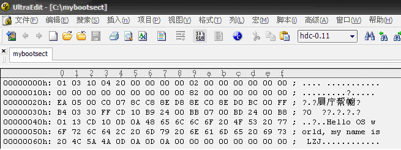
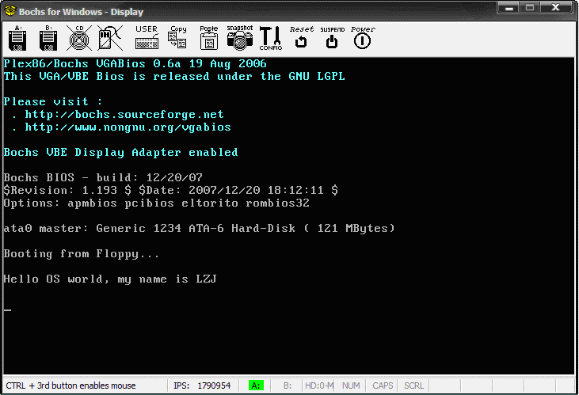

#### 6.3 编译和运行   `dd bs if= of= skip`


Ubuntu 上先从终端进入 ~/oslab/linux-0.11/boot/ 目录。

Windows 上则先双击快捷方式 “MinGW32.bat”，将打开一个命令行窗口，当前目录是 oslab，用 cd 命令进入 linux-0.11\boot。

无论那种系统，都执行下面两个命令编译和链接 bootsect.s：

```bash
$ as86 -0 -a -o bootsect.o bootsect.s
$ ld86 -0 -s -o bootsect bootsect.o
```

其中 `-0`（注意：这是数字 0，不是字母 O）表示生成 8086 的 16 位目标程序，`-a` 表示生成与 GNU as 和 ld 部分兼容的代码，`-s` 告诉链接器 ld86 去除最后生成的可执行文件中的符号信息。

如果这两个命令没有任何输出，说明编译与链接都通过了。

Ubuntu 下用 `ls -l` 可列出下面的信息：

```txt
-rw--x--x    1  root  root  544  Jul  25  15:07   bootsect
-rw------    1  root  root  257  Jul  25  15:07   bootsect.o
-rw------    1  root  root  686  Jul  25  14:28   bootsect.s
```

Windows 下用 dir 可列出下面的信息：

```txt
2008-07-28  20:14               544 bootsect
2008-07-28  20:14               924 bootsect.o
2008-07-26  20:13             5,059 bootsect.s
```

其中 bootsect.o 是中间文件。bootsect 是编译、链接后的目标文件。

需要留意的文件是 bootsect 的文件大小是 544 字节，而引导程序必须要正好占用一个磁盘扇区，即 512 个字节。造成多了 32 个字节的原因是 ld86 产生的是 Minix 可执行文件格式，这样的可执行文件除了文本段、数据段等部分以外，还包括一个 Minix 可执行文件头部，它的结构如下：

```c
struct exec {
    unsigned char a_magic[2];  //执行文件魔数
    unsigned char a_flags;
    unsigned char a_cpu;       //CPU标识号
    unsigned char a_hdrlen;    //头部长度，32字节或48字节
    unsigned char a_unused;
    unsigned short a_version;
    long a_text; long a_data; long a_bss; //代码段长度、数据段长度、堆长度
    long a_entry;    //执行入口地址
    long a_total;    //分配的内存总量
    long a_syms;     //符号表大小
};
```

算一算：6 char（6 字节）+ 1 short（2 字节） + 6 long（24 字节）= 32，正好是 32 个字节，去掉这 32 个字节后就可以放入引导扇区了（这是 `tools/build.c` 的用途之一）。

对于上面的 Minix 可执行文件，其 a_magic[0]=0x01，a_magic[1]=0x03，a_flags=0x10（可执行文件），a_cpu=0x04（表示 Intel i8086/8088，如果是 0x17 则表示 Sun 公司的 SPARC），所以 bootsect 文件的头几个字节应该是 01 03 10 04。为了验证一下，Ubuntu 下用命令“hexdump -C bootsect”可以看到：

```txt
00000000  01 03 10 04 20 00 00 00  00 02 00 00 00 00 00 00  |.... ...........|
00000010  00 00 00 00 00 00 00 00  00 82 00 00 00 00 00 00  |................|
00000020  b8 c0 07 8e d8 8e c0 b4  03 30 ff cd 10 b9 17 00  |.........0......|
00000030  bb 07 00 bd 3f 00 b8 01  13 cd 10 b8 00 90 8e c0  |....?...........|
00000040  ba 00 00 b9 02 00 bb 00  02 b8 04 02 cd 13 73 0a  |..............s.|
00000050  ba 00 00 b8 00 00 cd 13  eb e1 ea 00 00 20 90 0d  |............. ..|
00000060  0a 53 75 6e 69 78 20 69  73 20 72 75 6e 6e 69 6e  |.Sunix is runnin|
00000070  67 21 0d 0a 0d 0a 00 00  00 00 00 00 00 00 00 00  |g!..............|
00000080  00 00 00 00 00 00 00 00  00 00 00 00 00 00 00 00  |................|
*
00000210  00 00 00 00 00 00 00 00  00 00 00 00 00 00 55 aa  |..............U.|
00000220
```

Windows 下用 UltraEdit 把该文件打开，果然如此。



图 1 用 UltraEdit 打开文件 bootsect

接下来干什么呢？是的，要去掉这 32 个字节的文件头部（`tools/build.c` 的功能之一就是这个）！随手编个小的文件读写程序都可以去掉它。不过，懒且聪明的人会在 Ubuntu 下用命令：

```bash
$ dd bs=1 if=bootsect of=Image skip=32
```

生成的 Image 就是去掉文件头的 bootsect。

Windows 下可以用 UltraEdit 直接删除（选中这 32 个字节，然后按 Ctrl+X）。

去掉这 32 个字节后，将生成的文件拷贝到 linux-0.11 目录下，并一定要命名为“Image”（注意大小写）。然后就“run”吧！

```bash
# 当前的工作路径为 /home/shiyanlou/oslab/linux-0.11/boot/

# 将刚刚生成的 Image 复制到 linux-0.11 目录下
$ cp ./Image ../Image

# 执行 oslab 目录中的 run 脚本
$ ../../run
```



图 2 bootsect 引导后的系统启动情况


下一步