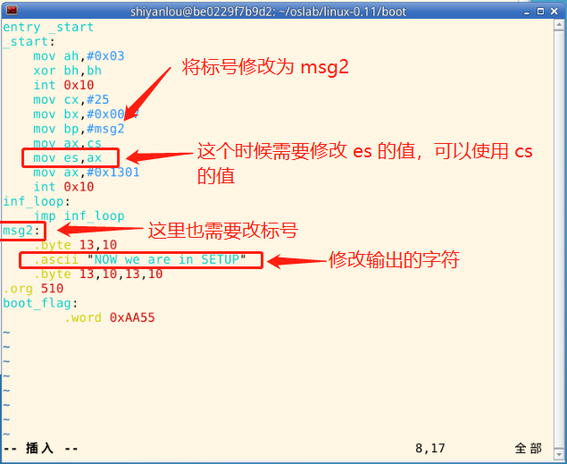

#### bootsect.s 读入 setup.s

2022年4月8日15:29:03

---

首先编写一个 setup.s，该 setup.s 可以就直接拷贝前面的 bootsect.s（还需要简单的调整），然后将其中的显示的信息改为：“Now we are in SETUP”。

可供参考的代码如下图所示：



接下来需要编写 bootsect.s 中载入 setup.s 的关键代码。原版 `bootsect.s` 中下面的代码就是做这个的。

```asm
load_setup:
! 设置驱动器和磁头(drive 0, head 0): 软盘 0 磁头
    mov dx,#0x0000
! 设置扇区号和磁道(sector 2, track 0): 0 磁头、0 磁道、2 扇区
    mov cx,#0x0002
! 设置读入的内存地址：BOOTSEG+address = 512，偏移512字节
    mov bx,#0x0200
! 设置读入的扇区个数(service 2, nr of sectors)，
! SETUPLEN是读入的扇区个数，Linux 0.11 设置的是 4，
! 我们不需要那么多，我们设置为 2（因此还需要添加变量 SETUPLEN=2）
    mov ax,#0x0200+SETUPLEN
! 应用 0x13 号 BIOS 中断读入 2 个 setup.s扇区
    int 0x13
! 读入成功，跳转到 ok_load_setup: ok - continue
    jnc ok_load_setup
! 软驱、软盘有问题才会执行到这里。我们的镜像文件比它们可靠多了
    mov dx,#0x0000
! 否则复位软驱 reset the diskette
    mov ax,#0x0000
    int 0x13
! 重新循环，再次尝试读取
    jmp load_setup
ok_load_setup:
! 接下来要干什么？当然是跳到 setup 执行。
! 要注意：我们没有将 bootsect 移到 0x9000，因此跳转后的段地址应该是 0x7ce0
! 即我们要设置 SETUPSEG=0x07e0
```

所有需要的功能在原版 bootsect.s 中都是存在的，我们要做的仅仅是将这些代码添加到新的 `bootsect.s` 中去。

除了新增代码，我们还需要去掉 5.2 小节中我们在 `bootsect.s` 添加的无限循环。

编写完成后大致如下：

```asm
SETUPLEN=2
SETUPSEG=0x07e0
entry _start
_start:
    mov ah,#0x03
    xor bh,bh
    int 0x10
    mov cx,#36
    mov bx,#0x0007
    mov bp,#msg1
    mov ax,#0x07c0
    mov es,ax
    mov ax,#0x1301
    int 0x10
load_setup:
    mov dx,#0x0000
    mov cx,#0x0002
    mov bx,#0x0200
    mov ax,#0x0200+SETUPLEN
    int 0x13
    jnc ok_load_setup
    mov dx,#0x0000
    mov ax,#0x0000
    int 0x13
    jmp load_setup
ok_load_setup:
    jmpi    0,SETUPSEG
msg1:
    .byte   13,10
    .ascii  "Hello OS world, my name is LZJ"
    .byte   13,10,13,10
.org 510
boot_flag:
    .word   0xAA55
```