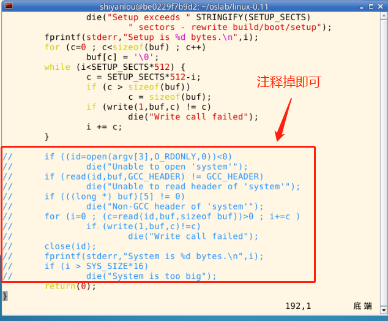
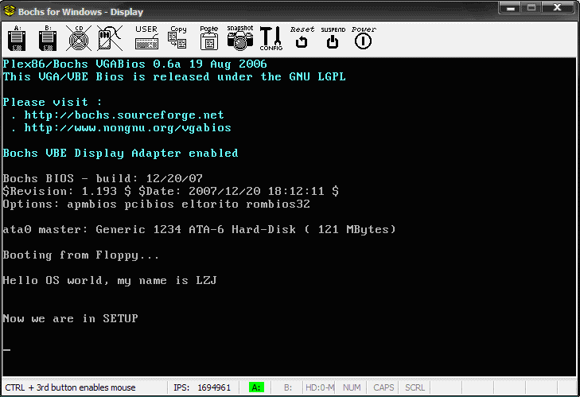

#### 修改 build.c  (argv[3]置为0)

2022年4月8日15:36:30

---

`build.c` 从命令行参数得到 bootsect、setup 和 system 内核的文件名，将三者做简单的整理后一起写入 Image。其中 system 是第三个参数（argv[3]）。当 “make all” 或者 “makeall” 的时候，这个参数传过来的是正确的文件名，`build.c` 会打开它，将内容写入 Image。**而 “make BootImage” 时，传过来的是字符串 "none"。所以，改造 build.c 的思路就是当 argv[3] 是"none"的时候，只写 bootsect 和 setup，忽略所有与 system 有关的工作，或者在该写 system 的位置都写上 “0”。**

修改工作主要集中在 `build.c` 的尾部，可以参考下面的方式，将圈起来的部分注释掉。



当按照前一节所讲的编译方法编译成功后再 run，就得到了如图 3 所示的运行结果，和我们想得到的结果完全一样。

```bash
$ cd ~/oslab/linux-0.11
$ make BootImage
$ ../run
```



图 3 用修改后的 bootsect.s 和 setup.s 进行引导的结果