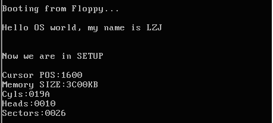

显示获得的参数


现在已经将硬件参数（只包括光标位置、内存大小和硬盘参数，其他硬件参数取出的方法基本相同，此处略去）取出来放在了 0x90000 处，接下来的工作是将这些参数显示在屏幕上。这些参数都是一些无符号整数，所以需要做的主要工作是用汇编程序在屏幕上将这些整数显示出来。

以十六进制方式显示比较简单。这是因为十六进制与二进制有很好的对应关系（每 4 位二进制数和 1 位十六进制数存在一一对应关系），显示时只需将原二进制数每 4 位划成一组，按组求对应的 ASCII 码送显示器即可。ASCII 码与十六进制数字的对应关系为：0x30 ～ 0x39 对应数字 0 ～ 9，0x41 ～ 0x46 对应数字 a ～ f。从数字 9 到 a，其 ASCII 码间隔了 7h，这一点在转换时要特别注意。为使一个十六进制数能按高位到低位依次显示，实际编程中，需对 bx 中的数每次循环左移一组（4 位二进制），然后屏蔽掉当前高 12 位，对当前余下的 4 位（即 1 位十六进制数）求其 ASCII 码，要判断它是 0 ～ 9 还是 a ～ f，是前者则加 0x30 得对应的 ASCII 码，后者则要加 0x37 才行，最后送显示器输出。以上步骤重复 4 次，就可以完成 bx 中数以 4 位十六进制的形式显示出来。

下面是完成显示 16 进制数的汇编语言程序的关键代码，其中用到的 BIOS 中断为 INT 0x10，功能号 0x0E（显示一个字符），即 AH=0x0E，AL=要显示字符的 ASCII 码。

```asm
! 以 16 进制方式打印栈顶的16位数
print_hex:
! 4 个十六进制数字
    mov cx,#4
! 将(bp)所指的值放入 dx 中，如果 bp 是指向栈顶的话
    mov dx,(bp)
print_digit:
! 循环以使低 4 比特用上 !! 取 dx 的高 4 比特移到低 4 比特处。
    rol dx,#4
! ah = 请求的功能值，al = 半字节(4 个比特)掩码。
    mov ax,#0xe0f
! 取 dl 的低 4 比特值。
    and al,dl
! 给 al 数字加上十六进制 0x30
    add al,#0x30
    cmp al,#0x3a
! 是一个不大于十的数字
    jl  outp
! 是a～f，要多加 7
    add al,#0x07
outp:
    int 0x10
    loop    print_digit
    ret
! 这里用到了一个 loop 指令;
! 每次执行 loop 指令，cx 减 1，然后判断 cx 是否等于 0。
! 如果不为 0 则转移到 loop 指令后的标号处，实现循环；
! 如果为0顺序执行。
!
! 另外还有一个非常相似的指令：rep 指令，
! 每次执行 rep 指令，cx 减 1，然后判断 cx 是否等于 0。
！ 如果不为 0 则继续执行 rep 指令后的串操作指令，直到 cx 为 0，实现重复。

! 打印回车换行
print_nl:
! CR
    mov ax,#0xe0d
    int 0x10
! LF
    mov al,#0xa
    int 0x10
    ret
```

只要在适当的位置调用 print_bx 和 print_nl（注意，一定要设置好栈，才能进行函数调用）就能将获得硬件参数打印到屏幕上，完成此次实验的任务。但事情往往并不总是顺利的，前面的两个实验大多数实验者可能一次就编译调试通过了（这里要提醒大家：编写操作系统的代码一定要认真，因为要调试操作系统并不是一件很方便的事）。但在这个实验中会出现运行结果不对的情况（为什么呢？因为我们给的代码并不是 100% 好用的）。所以接下来要复习一下汇编，并阅读《Bochs 使用手册》，学学在 Bochs 中如何调试操作系统代码。

我想经过漫长而痛苦的调试后，大家一定能兴奋地得到下面的运行结果：



图 4 用可以打印硬件参数的 setup.s 进行引导的结果

Memory Size 是 0x3C00KB，算一算刚好是 15MB（扩展内存），加上 1MB 正好是 16MB，看看 Bochs 配置文件 bochs/bochsrc.bxrc：

```asm
!……
megs: 16
!……
ata0-master: type=disk, mode=flat, cylinders=410, heads=16, spt=38
!……
```

这些都和上面打出的参数吻合，表示此次实验是成功的。

> 实验楼的环境中参数可能跟上面给出的不一致。大家需要根据自己环境中 `bochs/bochsrc.bxrc` 文件中的内容才能确定具体的输出信息。

下面是提供的参考代码，大家可以根据这个来进行编写代码：

```asm
INITSEG  = 0x9000
entry _start
_start:
! Print "NOW we are in SETUP"
    mov ah,#0x03
    xor bh,bh
    int 0x10
    mov cx,#25
    mov bx,#0x0007
    mov bp,#msg2
    mov ax,cs
    mov es,ax
    mov ax,#0x1301
    int 0x10

    mov ax,cs
    mov es,ax
! init ss:sp
    mov ax,#INITSEG
    mov ss,ax
    mov sp,#0xFF00

! Get Params
    mov ax,#INITSEG
    mov ds,ax
    mov ah,#0x03
    xor bh,bh
    int 0x10
    mov [0],dx
    mov ah,#0x88
    int 0x15
    mov [2],ax
    mov ax,#0x0000
    mov ds,ax
    lds si,[4*0x41]
    mov ax,#INITSEG
    mov es,ax
    mov di,#0x0004
    mov cx,#0x10
    rep
    movsb

! Be Ready to Print
    mov ax,cs
    mov es,ax
    mov ax,#INITSEG
    mov ds,ax

! Cursor Position
    mov ah,#0x03
    xor bh,bh
    int 0x10
    mov cx,#18
    mov bx,#0x0007
    mov bp,#msg_cursor
    mov ax,#0x1301
    int 0x10
    mov dx,[0]
    call    print_hex
! Memory Size
    mov ah,#0x03
    xor bh,bh
    int 0x10
    mov cx,#14
    mov bx,#0x0007
    mov bp,#msg_memory
    mov ax,#0x1301
    int 0x10
    mov dx,[2]
    call    print_hex
! Add KB
    mov ah,#0x03
    xor bh,bh
    int 0x10
    mov cx,#2
    mov bx,#0x0007
    mov bp,#msg_kb
    mov ax,#0x1301
    int 0x10
! Cyles
    mov ah,#0x03
    xor bh,bh
    int 0x10
    mov cx,#7
    mov bx,#0x0007
    mov bp,#msg_cyles
    mov ax,#0x1301
    int 0x10
    mov dx,[4]
    call    print_hex
! Heads
    mov ah,#0x03
    xor bh,bh
    int 0x10
    mov cx,#8
    mov bx,#0x0007
    mov bp,#msg_heads
    mov ax,#0x1301
    int 0x10
    mov dx,[6]
    call    print_hex
! Secotrs
    mov ah,#0x03
    xor bh,bh
    int 0x10
    mov cx,#10
    mov bx,#0x0007
    mov bp,#msg_sectors
    mov ax,#0x1301
    int 0x10
    mov dx,[12]
    call    print_hex

inf_loop:
    jmp inf_loop

print_hex:
    mov    cx,#4
print_digit:
    rol    dx,#4
    mov    ax,#0xe0f
    and    al,dl
    add    al,#0x30
    cmp    al,#0x3a
    jl     outp
    add    al,#0x07
outp:
    int    0x10
    loop   print_digit
    ret
print_nl:
    mov    ax,#0xe0d     ! CR
    int    0x10
    mov    al,#0xa     ! LF
    int    0x10
    ret

msg2:
    .byte 13,10
    .ascii "NOW we are in SETUP"
    .byte 13,10,13,10
msg_cursor:
    .byte 13,10
    .ascii "Cursor position:"
msg_memory:
    .byte 13,10
    .ascii "Memory Size:"
msg_cyles:
    .byte 13,10
    .ascii "Cyls:"
msg_heads:
    .byte 13,10
    .ascii "Heads:"
msg_sectors:
    .byte 13,10
    .ascii "Sectors:"
msg_kb:
    .ascii "KB"

.org 510
boot_flag:
    .word 0xAA55
```