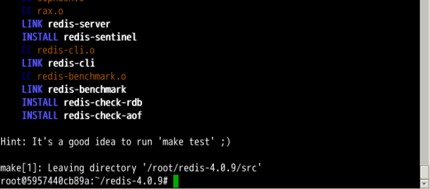
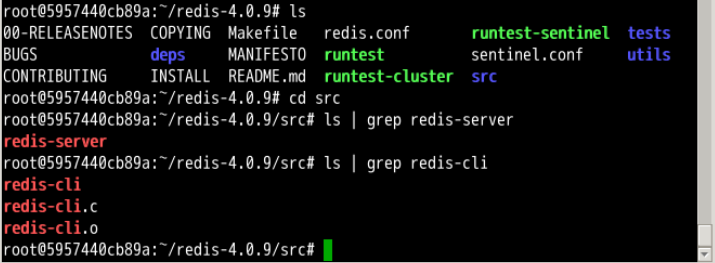
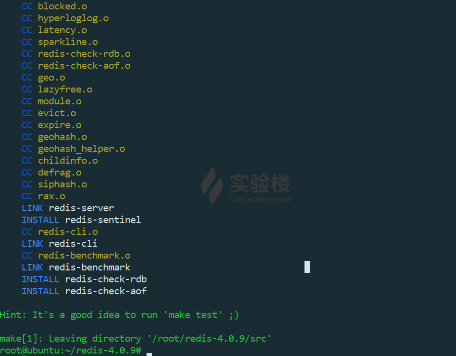
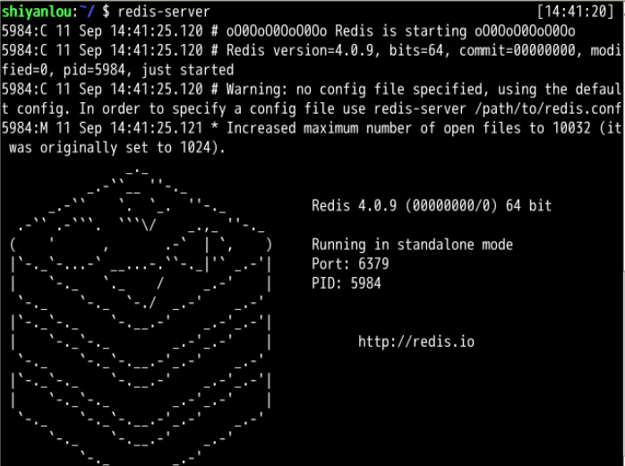
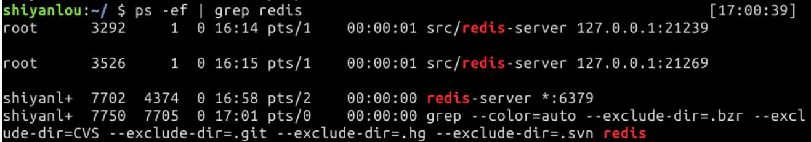
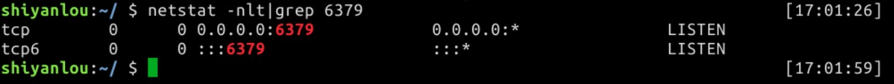
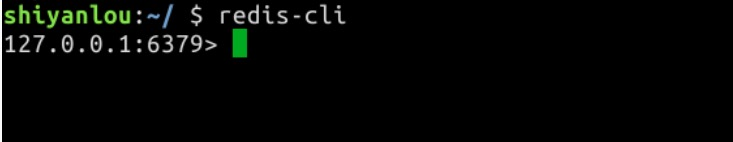

# Redis安装

2022年10月10日22:26:50

----

#### 知识点

- Redis 简介
- Redis 的安装
- Redis 的启动


#### Redis 的安装步骤

```
下面的安装步骤仅为示例大家不需要在环境中进行操作。
```

redis 手动安装的话非常简单，以 redis-4.0.9 版本为例。

首先进入 root 目录并下载 Redis 的程序包：

```bash
sudo su
cd
wget https://labfile.oss-internal.aliyuncs.com/courses/106/redis-4.0.9.tar.gz
```

在目录下，解压安装包，生成新的目录 redis-4.0.9：

```bash
tar -xzvf redis-4.0.9.tar.gz
```

进入解压之后的目录，进行编译：

```bash
cd redis-4.0.9
make
```

说明：如果没有明显的错误，则表示编译成功。

操作截图：



#### 查看重要文件

在 Redis 安装完成后，注意一些重要的文件，可用 **ls** 命令查看。

- 服务端：src/redis-server
- 客户端：src/redis-cli
- 默认配置文件：redis.conf



#### 设置环境变量

```
在线环境中已经安装 redis，不用再设置。
```

为了今后能更方便地打开 Redis 服务器和客户端，可以将 src 目录下的 redis-server 和 redis-cli 添加进环境变量所属目录里面。

```bash
cp redis-server /usr/local/bin/
cp redis-cli /usr/local/bin/
```

添加完成后在任何目录下输入 `redis-server` 可启动服务器，输入 `redis-cli` 可启动客户端。

#### 运行测试

在前面的步骤设置完成后可以运行测试（非必须），确认 Redis 的功能是否正常。

```bash
cd /root/redis-4.0.9
make test
```

如果提示 `You need tcl 8.5 or newer in order to run the Redis test`

可以安装 tcl，然后再进行测试

```bash
sudo apt-get install tcl -y
```

**因为在线环境配置有限，所以运行测试需要花费比较久的时间，而且最终测试可能会因为超时而报错，不过并不会影响使用。**

这是在我本地虚拟机运行 `make test` 的结果：




Redis 是一个服务端和客户端配合的程序。和 Mysql 类似，因此要使用 Redis 需要先启动服务端，客户端有多种形式，比如在 Java 中连接 Redis 服务器也是扮演了一个客户端的角色，本节实验中采用终端的形式来对 Redis 的各项操作进行练习。

#### 启动 Redis-server

在实验环境中可以输入 `sudo service redis-server start` 命令直接开启 redis，也可以在命令行终端输入命令：

```bash
redis-server
```

操作截图：



说明：从以上的截图中，可以发现启动的端口为缺省的 6379。用户可以在启动的时候，指定具体的配置文件，并在其中指定启动的端口。

此时要使用 Redis-Client 需要保持此终端的运行，重开一个终端标签。

#### 查看 Redis

在命令行终端执行如下命令查看 Redis：

```bash
ps -ef | grep redis
```

操作截图：



通过端口号检查 Redis 服务器状态：

```bash
netstat -nlt| grep 6379
```

操作截图：



#### 启动 Redis-client

在命令行终端执行如下命令启动 Redis-client：

```bash
redis-cli
```

操作结果：



至此，redis 启动完成。

在有的环境下，redis 交互环境可能出现中文乱码的情况，解决办法是用下列命令启动 redis 客户端：

```bash
redis-cli --raw
```