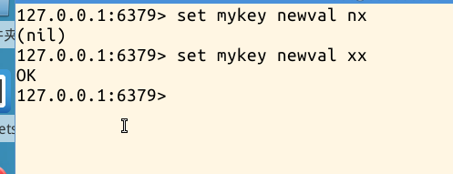
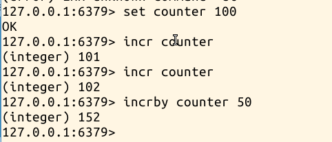
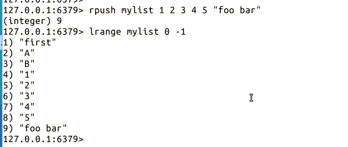
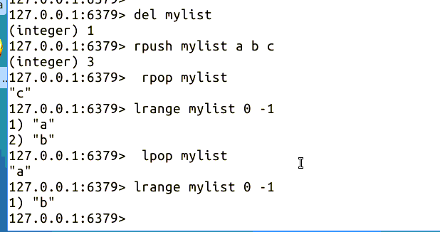
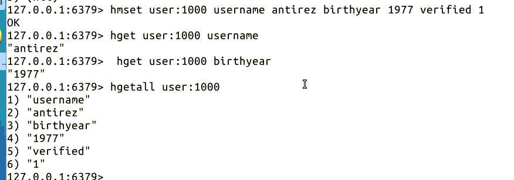
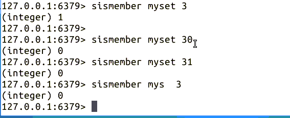
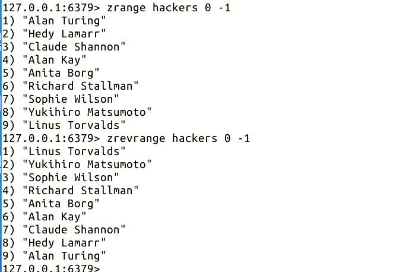
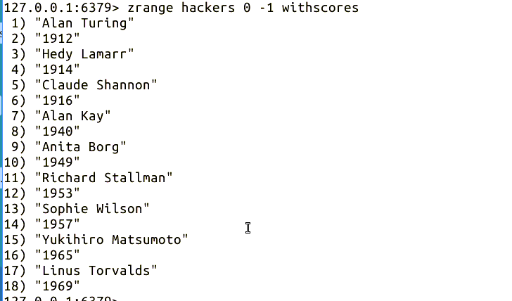

# Redis数据类型

2022年10月10日22:19:38

----

Redis 不仅仅是简单的 key-value 存储器，同时也是一种 data structures server。传统的 key-value 是指支持使用一个 key 字符串来索引 value 字符串的存储，而 Redis 中，value 不仅仅支持字符串，还支持更多的复杂结构，包括列表、集合、哈希表等。

现在我们一一讲解：Redis keys 是采用二进制安全，这就意味着你可以使用任何二进制序列作为重点，比如："foo" 可以联系一个 JPEG 文件；空字符串也是一个有效的密钥。

#### 知识点

- Redis strings
- Redis Lists
- Redis Hashes
- Redis 有序集合

Redis strings


### 字符串

字符串是一种最基本、最常用的 Redis 值类型。

Redis 字符串是二进制安全的，这意味着一个 Redis 字符串能包含任意类型的数据，例如： 一张经过 base64 编码的图片或者一个序列化的 Ruby 对象。通过这样的方式，Redis 的字符串可以支持任意形式的数据，但是对于过大的文件不适合存入 redis，一方面系统内存有限，另外一方面字符串类型的值最多能存储 512M 字节的内容。

启动 redis-cli 来看看 Redis strings 数据类型。

```bash
$ sudo service redis-server start
$ sudo su
$ cd
$ redis-cli
> set mykey somevalue
> get mykey
```

操作截图：


如上例所示，可以使用 set 和 get 命令来创建和检索 strings。注意：set 命令将取代现有的任何已经存在的 key。set 命令还有一个提供附加参数的选项，我们能够让 set 命令只有在没有相同 key 的情况下成功，反之亦然，可以让 set 命令在有相同 key 值的情况下成功：

```bash
> set mykey newval nx
> set mykey newval xx
```

操作截图;



即使 string 是 Redis 的基本类型，也可以对其进行一些有趣的操作，例如加法器：

```bash
> set counter 100 # 初始化
> incr counter   # +1
> incr counter   # +1
> incrby counter 50 # +50 自定义计数
```

操作截图：



incr 命令让 the value 成为一个整数，运行一次 incr 便加一。incrby 命令便是一个加法运算。类似的命令如减法运算为： decr 和 decrby。

Redis 可以运用 mset 和 mget 命令一次性完成多个 key-value 的对应关系，使用 mget 命令，Redis 返回一个 value 数组：

```bash
> mset a 10 b 20 c 30
> mget a b c
```

操作截图：


### Redis List

Redis Lists


Redis 列表是简单的字符串列表，按照插入顺序排序。你可以添加一个元素到列表的头部（左边）或者尾部（右边），lpush 命令插入一个新的元素到头部，而 rpush 命令插入一个新元素到尾部。当这两个操作中的任一操作在一个空的 Key 上执行时就会创建一个新的列表。相似的，如果一个列表操作清空一个列表，那么对应的 key 将被从 key 空间删除。

push 一类的命令的返回值为 list 的长度。这里有一些类表操作和结果的例子：

```bash
> rpush mylist A
> rpush mylist B
> lpush mylist first
> lrange mylist 0 -1
```

操作截图:


**注意**：lrange 需要两个索引，0 表示 list 开头第一个，-1 表示 list 的倒数第一个，即最后一个。-2 则是 list 的倒数第二个，以此类推。

这些命令都是可变的命令，也就是说你可以一次加入多个元素放入 list：

```bash
> rpush mylist 1 2 3 4 5 "foo bar"
> lrange mylist 0 -1
```

操作截图：



在 Redis 的命令操作中，还有一类重要的操作 `pop`，它可以弹出一个元素，简单的理解就是获取并删除第一个元素，和 `push` 类似的是它也支持双边的操作，可以从右边弹出一个元素也可以从左边弹出一个元素，对应的指令为 `rpop` 和 `lpop`：

```bash
> del mylist
> rpush mylist a b c
> rpop mylist
> lrange mylist 0 -1
> lpop mylist
> lrange mylist 0 -1
```

操作截图：



一个列表最多可以包含 4294967295（2 的 32 次方减一）个元素，这意味着它可以容纳海量的信息，最终瓶颈一般都取决于服务器内存大小。

事实上，在高级的企业架构当中，会把缓存服务器分离开来，因为数据库服务器和缓存服务器的特点各异，比如对于数据库服务器应该用更快、更大的硬盘，而缓存专用服务器则偏向内存性能，一般都是 64GB 起步。

#### List 阻塞操作

理解阻塞操作对一些请求操作有很大的帮助，关于阻塞操作的作用，这里举一个例子。

假如你要去楼下买一个汉堡，一个汉堡需要花一定的时间才能做出来，非阻塞式的做法是去付完钱走人，过一段时间来看一下汉堡是否做好了，没好就先离开，过一会儿再来，而且要知道可能不止你一个人在买汉堡，在你离开的时候很可能别人会取走你的汉堡，这是很让人烦的事情。

阻塞式就不一样了，付完钱一直在那儿等着，不拿到汉堡不走人，并且后面来的人统统排队。

Redis 提供了阻塞式访问 `brpop` 和 `blpop` 命令。用户可以在获取数据不存在时阻塞请求队列，如果在时限内获得数据则立即返回，如果超时还没有数据则返回 nil。

在终端执行：

```bash
brpop list 10
brpop mylist 10
```


#### List 常见应用场景

分析 List 应用场景需要结合它的特点，List 元素是线性有序的，很容易就可以联想到聊天记录，你一言我一语都有先后，因此 List 很适合用来存储聊天记录等顺序结构的数据。


### Redis Hashs

Redis Hashes


Redis Hashes 是字符串字段和字符串值之间的映射，因此它们是展现对象的完整数据类型。例如一个有名、姓、年龄等等属性的用户：一个带有一些字段的 hash 仅仅需要一块很小的空间存储，因此你可以存储数以百万计的对象在一个小的 Redis 实例中。哈希主要用来表现对象，它们有能力存储很多对象，因此你可以将哈希用于许多其它的任务。

```bash
> hmset user:1000 username antirez birthyear 1977 verified 1
> hget user:1000 username
> hget user:1000 birthyear
> hgetall user:1000
```

操作截图：



hmset 命令设置一个多域的 hash 表，hget 命令获取指定的单域，hgetall 命令获取指定 key 的所有信息。hmget 类似于 hget，只是返回一个 value 数组。

```bash
> hmget user:1000 username birthyear no-such-field
```

操作截图：


同样可以根据需要对 hash 表的表项进行单独的操作，例如 hincrby： （原本 birthyear 为 1977，见上一图）

```bash
> hincrby user:1000 birthyear 10
> hincrby user:1000 birthyear 10
```

操作截图：


### Redis 无序集合

Redis 无序集合


Redis 集合（Set）是一个无序的字符串集合。你可以以 O(1) 的时间复杂度（无论集合中有多少元素时间复杂度都是常量）完成添加、删除以及测试元素是否存在。

Redis 集合拥有令人满意的不允许包含相同成员的属性，多次添加相同的元素，最终在集合里只会有一个元素，这意味着它可以非常方便地对数据进行去重操作。一个 Redis 集合的非常有趣的事情是它支持一些服务端的命令从现有的集合出发去进行集合运算，因此你可以在非常短的时间内进行合并（unions），求交集（intersections），找出不同的元素（differences of sets）。

```bash
> sadd myset 1 2 3
> smembers myset
```

sadd 命令产生一个无序集合，返回集合的元素个数。smembers 用于查看集合。

操作截图：


sismember 用于查看集合是否存在，匹配项包括集合名和元素（用于查看该元素是否是集合的成员）。匹配成功返回 1，匹配失败返回 0。

```bash
> sismember myset 3
> sismember myset 30
> sismember mys 3
```

操作截图：




### Redis有序集合

Redis 有序集合


Redis 有序集合与普通集合非常相似，是一个没有重复元素的字符串集合。不同之处是有序集合的每一个成员都关联了一个权值，这个权值被用来按照从最低分到最高分的方式排序集合中的成员。集合的成员是唯一的，但是权值可以是重复的。

使用有序集合你可以以非常快的速度 `O(log(N))` 添加、删除和更新元素。因为元素是有序的，所以你也可以很快的根据权值（score）或者次序（position）来获取一个范围的元素。访问有序集合的中间元素也是非常快的，因此你能够使用有序集合作为一个没有重复成员的智能列表。在有序集合中，你可以很快捷的访问一切你需要的东西：有序的元素，快速的存在性测试，快速访问集合的中间元素！简而言之使用有序集合你可以完成许多对性能有极端要求的任务，而那些任务使用其它类型的数据库真的是很难完成的。

zadd 与 sadd 类似，但是在元素之前多了一个参数，这个参数便是用于排序的。形成一个有序的集合。

```bash
> zadd hackers 1940 "Alan Kay"
> zadd hackers 1957 "Sophie Wilson"
> zadd hackers 1953 "Richard Stallman"
> zadd hackers 1949 "Anita Borg"
> zadd hackers 1965 "Yukihiro Matsumoto"
> zadd hackers 1914 "Hedy Lamarr"
> zadd hackers 1916 "Claude Shannon"
> zadd hackers 1969 "Linus Torvalds"
> zadd hackers 1912 "Alan Turing"
```

查看集合：zrange 是查看正序的集合，zrevrange 是查看反序的集合。0 表示集合第一个元素，-1 表示集合的倒数第一个元素。

```bash
> zrange hackers 0 -1
> zrevrange hackers 0 -1
```

操作截图：



使用 withscores 参数返回记录值。

```bash
> zrange hackers 0 -1 withscores
```

操作截图：




