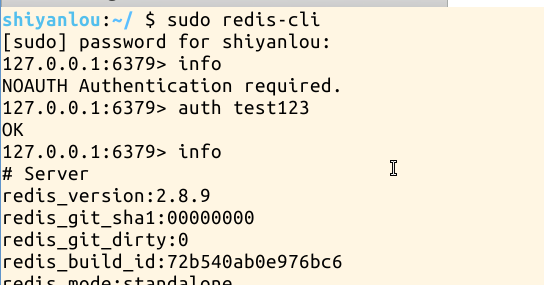
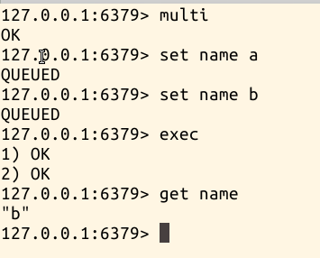

# Redis系统管理

2022年10月10日22:28:58

---

前面学习了 Redis 的基础知识和基本命令，接下来继续讲解 Redis 的高级应用，包括：安全性设置，主从复制，事务处理，持久化机制，虚拟内存的使用。

#### 知识点

- 安全性
- 主从复制
- 事务处理
- 持久化机制
- 虚拟内存的使用

---

### 安全性


涉及到客户端连接是需要指定密码的（由于 redis 速度相当的快，一秒钟可以 150K 次的密码尝试，所以需要设置一个强度很大的密码）。

设置密码的方式有两种：

- 使用 `config set` 命令的 requirepass 参数，具体格式为 `config set requirepass [password]"`。
- 在 redis.conf 文件中设置 requirepass 属性，后面为密码。

输入认证的方式也有两种：

- 登录时可以使用 `redis-cli -a password`。
- 登录后可以使用 `auth password`。

#### 设置密码

第一种密码设置方式在上一个实验中已经提到（在 CONFIG SET 命令讲解的实例），此处我们来看看第二种方式设置密码。

首先需要进入 Redis 的安装目录，然后修改配置文件 `redis.conf`。根据 grep 命令的结果，使用 vim 编辑器修改 “# requirepass foobared” 为 “requirepass test123”，然后保存退出。

```bash
sudo grep -n requirepass /etc/redis/redis.conf
sudo vim /etc/redis/redis.conf
```

编辑 `redis.conf` 的结果：


#### 重启 redis-server 与 redis-cli

重启 redis server：

```bash
sudo service redis-server restart
```

进入到 redis-cli 交互界面进行验证：

```bash
$ redis-cli
> info
> auth test123
> info
> exit
```

操作截图：



结果表明第一次 info 命令失败，在 auth 认证之后 info 命令正常返回，最后退出 redis-cli。

另外一种密码认证方式：

```bash
$ redis-cli -a test123
> info
```

操作截图：


---

### 主从复制


为了分担服务器压力，会在特定情况下部署多台服务器分别用于缓存的读和写操作，用于写操作的服务器称为主服务器，用于读操作的服务器称为从服务器。

从服务器通过 psync 操作同步主服务器的写操作，并按照一定的时间间隔更新主服务器上新写入的内容。

> 实验楼环境不适合做多个服务器的实验，因此下面只做讲解，有条件的同学可以配置多台服务器进行测试

Redis 主从复制的过程：

1. Slave 与 Master 建立连接，发送 psync 同步命令。
2. Master 会启动一个后台进程，将数据库快照保存到文件中，同时 Master 主进程会开始收集新的写命令并缓存。
3. 后台完成保存后，就将此文件发送给 Slave。
4. Slave 将此文件保存到磁盘上。

Redis 主从复制特点：

1. 可以拥有多个 Slave。
2. 多个 Slave 可以连接同一个 Master 外，还可以连接到其它的 Slave。（当 Master 宕机后，相连的 Slave 转变为 Master）。
3. 主从复制不会阻塞 Master，在同步数据时， Master 可以继续处理 Client 请求。
4. 提高了系统的可伸缩性。

从服务器的主要作用是响应客户端的数据请求，比如返回一篇博客信息。

上面说到了主从复制是不会阻塞 Master 的，就是说 Slave 在从 Master 复制数据时，Master 的删改插入等操作继续进行不受影响。

如果在同步过程中，主服务器修改了一篇博客，而同步到从服务器上的博客是修改前的。这时候就会出现时间差，即修改了博客过后，在访问网站的时候还是原来的数据，这是因为从服务器还未同步最新的更改，这也就意味着非阻塞式的同步只能应用于对读数据延迟接受度较高的场景。

要建立这样一个主从关系的缓存服务器，只需要在 Slave 端执行命令:

```bash
# SLAVEOF IPADDRESS PORT
> SLAVEOF 127.0.0.1 6379
```

如果主服务器设置了连接密码，就需要在从服务器中事先设置好：

```bash
config set masterauth <password>
```

这样，当前服务器就作为 127.0.0.1:6379 下的一个从服务器，它将定期从该服务器复制数据到自身。

在以前的版本中（2.8 以前），你应该慎用 redis 的主从复制功能，因为它的同步机制效率低下，可以想象每一次短线重连都要复制主服务器上的全部数据，算上网络通讯所耗费的时间，反而可能达不到通过 redis 缓存来提升应用响应速度的效果。但是幸运的是，官方在 2.8 以后推出了解决方案，通过部分同步来解决大量的重复操作。

这需要主服务器和从服务器都至少达到 2.8 的版本要求。

### 事务处理

Redis 的事务处理比较简单。只能保证 client 发起的事务中的命令可以连续的执行，而且不会插入其它的 client 命令，当一个 client 在连接中发出 `multi` 命令时，这个连接就进入一个事务的上下文，该连接后续的命令不会执行，而是存放到一个队列中，当执行 `exec` 命令时，redis 会顺序的执行队列中的所有命令。

```bash
> multi
> set name a
> set name b
> exec
> get name
```

操作截图：



需要注意的是，redis 对于事务的处理方式比较特殊，它不会在事务过程中出错时恢复到之前的状态，这在实际应用中导致我们不能依赖 redis 的事务来保证数据一致性。

---

### 持久化机制


内存和磁盘的区别除了速度差别以外，还有就是内存中的数据会在重启之后消失，持久化的作用就是要将这些数据长久存到磁盘中以支持长久使用。

Redis 是一个支持持久化的内存数据库，Redis 需要经常将内存中的数据同步到磁盘来保证持久化。

Redis 支持两种持久化方式：

1、`snapshotting`（快照）：将数据存放到文件里，默认方式。 是将内存中的数据以快照的方式写入到二进制文件中，默认文件 dump.rdb，可以通过配置设置自动做快照持久化的方式。可配置 Redis 在 n 秒内如果超过 m 个 key 被修改就自动保存快照。比如： `save 900 1`：900 秒内如果超过 1 个 key 被修改，则发起快照保存。 `save 300 10`：300 秒内如果超过 10 个 key 被修改，则快照保存。 2、`Append-only file`（缩写为 aof）：将读写操作存放到文件中。

由于快照方式在一定间隔时间做一次，所以如果 Redis 意外 down 掉的话，就会丢失最后一次快照后的所有修改。

aof 比快照方式有更好的持久化性，是由于使用 aof 时，redis 会将每一个收到的写命令都通过 write 函数写入到文件中，当 redis 启动时会通过重新执行文件中保存的写命令来在内存中重新建立整个数据库的内容。

由于 os 会在内核中缓存 write 做的修改，所以可能不是立即写到磁盘上，这样 aof 方式的持久化也还是有可能会丢失一部分数据。可以通过配置文件告诉 redis 我们想要通过 fsync 函数强制 os 写入到磁盘的时机。

配置文件中的可配置参数：

```bash
appendonly yes //启用 aof 持久化方式

# appendfsync always //收到写命令就立即写入磁盘，最慢，但是保证了数据的完整持久化

appendfsync everysec //每秒钟写入磁盘一次，在性能和持久化方面做了很好的折中

# appendfsync no //完全依赖 os，性能最好，持久化没有保证
```

在 redis-cli 的命令中，`save` 命令是将数据写入磁盘中。

```bash
> help save
> save
```

操作截图：

> 


---

### 虚拟内存的使用


虚拟内存管理在 2.6 及之上版本取消了，取消了是指这部分内容在后面的版本会由 redis 软件自身管理。在本实验中，选择的是 4.0.9 版本的 redis，所以实验中的配置文件没有虚拟内存管理功能的配置选项，此处仅为讲解。

Redis 的虚拟内存是暂时把不经常访问的数据从内存交换到磁盘中，从而腾出内存空间用于其它的访问数据，尤其对于 redis 这样的内存数据库，内存总是不够用的。除了分隔到多个 redis server 外，提高数据库容量的方法就是使用虚拟内存，把那些不常访问的数据交换到磁盘上。

通过配置 vm 相关的 `redis.config` 配置：

```bash
# 开启 vm 功能
vm-enable yes

# 交换出来的 value 保存的文件路径
vm-swap-file /tmp/redis.swap

# redis 使用的最大内存上限
vm-max-memory 10000000

# 每个页面的大小 32 字节
vm-page-size 32

# 最多使用多少个页面
vm-pages 123217729

# 用于执行 value 对象换入的工作线程数量
vm-max-threads 4
```