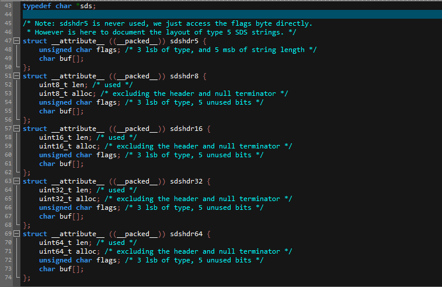
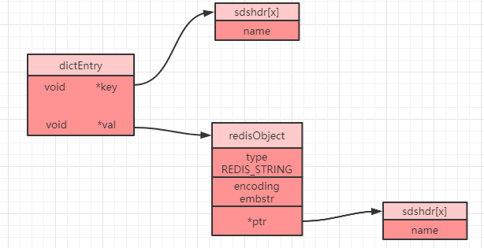

## 实验二 一个简单的字符串，为什么 Redis 要设计的如此特别

`Redis` 是基于 `C` 语言进行开发的，而 `C` 语言中的字符串是二进制不安全的(\0, 溢出问题)，所以 `Redis` 就没有直接使用 `C` 语言的字符串，而是自己编写了一个新的数据结构来表示字符串，这种数据结构称之为简单动态字符串（Simple dynamic string），简称 `sds`。

----

### sds 是如何被存储的



```c
struct __attribute__ ((__packed__)) sdshdr8 {
    uint8_t len; //已使用空间大小
    uint8_t alloc; //总共申请的空间大小(包括未使用的)
    unsigned char flags; //用来表示当前sds类型是sdshdr8还是sdshdr16等
    char buf[]; //真实存储字符串的字节数组
};
// old sds define
struct sdshdr{
  int len;//记录buf数组已使用的长度，即SDS的长度(不包含末尾的'\0')
  int free;//记录buf数组中未使用的长度
  char buf[];//字节数组，用来保存字符串
}
```

在 `Redis` 中所有的数据类型都是将对应的数据结构进行了再一次包装，创建了一个字典对象来存储，`sds` 也不例外。每次创建一个 `key-value` 键值对，`Redis` 都会创建两个对象，一个是键对象，一个是值对象。而且需要注意的是**在 `Redis` 中，值对象并不是直接存储，而是被包装成 `redisObject` 对象**，并同时将键对象和值对象通过 `dictEntry` 对象进行封装，如下就是一个 `dictEntry` 对象：

```c
typedef struct dictEntry {
    void *key;//指向key，即sds
    union {
        void *val;//指向value
        uint64_t u64;
        int64_t s64;
        double d;
    } v;
    struct dictEntry *next;//指向下一个key-value键值对(哈希值相同的键值对会形成一个链表，从而解决哈希冲突问题)
} dictEntry;
```

`redisObject` 对象的定义为：

```c
typedef struct redisObject {
    unsigned type:4;//对象类型（4位=0.5字节）
    unsigned encoding:4;//编码（4位=0.5字节）
    unsigned lru:LRU_BITS;//记录对象最后一次被应用程序访问的时间（24位=3字节）
    int refcount;//引用计数。等于0时表示可以被垃圾回收（32位=4字节）
    void *ptr;//指向底层实际的数据存储结构，如：sds等(8字节)
} robj;
```

当我们在 `Redis` 客户端中执行命令 `set name lonely_wolf `，就会得到下图所示的一个结构（省略了部分属性）：



看到这个图想必大家会有疑问，这里面的 `type` 和 `encoding` 到底是什么呢？其实这两个属性非常关键，`Redis` 就是通过这两个属性来识别当前的 `value` 到底属于哪一种基本数据类型，以及当前数据类型的底层采用了何种数据结构进行存储。

### type 属性

`type` 属性表示对象类型，其对应了 `Redis` 当中的 `5` 种基本数据类型：

| 类型属性     | 描述         | type 命令返回值 |
| ------------ | ------------ | --------------- |
| REDIS_STRING | 字符串对象   | string          |
| REDIS_LIST   | 列表对象     | list            |
| REDIS_HASH   | 哈希对象     | hash            |
| REDIS_SET    | 集合对象     | set             |
| REDIS_ZSET   | 有序集合对象 | zset            |

可以看到，这就是对应了我们 `5` 种常用的基本数据类型。


### encoding 属性

`Redis` 当中每种数据类型都是经过特别设计的，相信大家看完这个系列也会体会到 `Redis` 设计的精妙之处。字符串在我们眼里是非常简单的一种数据结构了，但是 `Redis` 却把它优化到了极致，为了节省空间，其通过编码的方式定义了三种不同的存储方式：

| 编码属性            | 描述                               | object encoding命令返回值 |
| ------------------- | ---------------------------------- | ------------------------- |
| OBJ_ENCODING_INT    | 使用整数的字符串对象               | int                       |
| OBJ_ENCODING_EMBSTR | 使用 `embstr` 编码实现的字符串对象 | embstr                    |
| OBJ_ENCODING_RAW    | 使用 `raw` 编码实现的字符串对象    | raw                       |