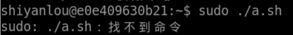

#### Hello World

Bash 之 Hello World

```
vim hello.sh
```

使用 vim 编辑 hello.sh，输入如下代码并保存：

```bash
#!/bin/bash
# This is a comment
echo Hello World
```

- `vim` 中插入按 `i`
- 保存并退出换行按 `esc` 然后输入 `:wq` 再按下 `enter`。
- `#!` 是说明 hello 这个文件的类型，有点类似于 Windows 系统下用不同文件后缀来表示不同文件类型的意思（但不相同）。
  - Linux 系统根据 `#!` 及该字符串后面的信息确定该文件的类型，可以通过 `man magic` 命令 及 `/usr/share/magic` 文件来了解这方面的更多内容。
  - 在 BASH 中 第一行的 `#!` 及后面的 `/bin/bash` 就表明该文件是一个 BASH 程序，需要由 `/bin` 目录下的 bash 程序来解释执行。BASH 这个程序一般是存放在 `/bin` 目录下，如果你的 Linux 系统比较特别，bash 也有可能被存放在 `/sbin` 、`/usr/local/bin` 、`/usr/bin` 、`/usr/sbin` 或 `/usr/local/sbin` 这样的目录下；如果还找不到，你可以用 `locate bash` ,`find / -name bash 2>/dev/null` 或 `whereis bash` 这三个命令找出 bash 所在的位置；如果仍然找不到，那你可能需要自己动手安装一个 BASH 软件包了。
- 第二行的 `# This is a ...` 就是 BASH 程序的注释，在 BASH 程序中从 `#` 号（注意：后面紧接着是 `!` 号的除外）开始到行尾的部分均被看作是程序的注释。
- 第三行的 `echo` 语句的功能是把 echo 后面的字符串输出到标准输出中去。由于 echo 后跟的是 "Hello World" 这个字符串，因此 "Hello World"这个字串就被显示在控制台终端的屏幕上了。需要注意的是 BASH 中的绝大多数语句结尾处都**没有分号**。

**运行 Bash 脚本的方式：**

```bash
# 使用shell来执行
sh hello.sh

# 使用bash来执行
bash hello.sh

# 使用.来执行
. ./hello.sh

# 使用source来执行
source hello.sh

# 还可以赋予脚本所有者执行权限，允许该用户执行该脚本
chmod u+rx hello.sh
./hello.sh
```

#### 使用重定向

比如我们想要**保存**刚刚的 hello world 为一个文本，那么该怎么办呢？

`>` 这个符号是重定向,执行以下代码，就会在当前目录下生成一个 my.txt。打开看看有没有 hello world

```bash
 #!/bin/bash
 echo "Hello World" > my.txt
```

#### 使用脚本清除 `/var/log` 下的 log 文件

首先我们看一看 `/var/log/dpkg.log` 里面有啥东西。

```bash
cat /var/log/dpkg.log
```

这个文件中记录了我们使用 apt 安装的软件包的一些信息，现在我们需要写一个脚本把里面的东西清空，但是保留文件。

```bash
vim cleanlogs.sh
```

说明：

`/dev/null` 这个东西可以理解为一个黑洞，里面是空的（可以用 cat 命令看一看）。

```bash
#!/bin/bash

# 初始化一个变量
LOG_DIR=/var/log

cd $LOG_DIR

cat /dev/null > dpkg.log

echo "Logs cleaned up."

exit
```

运行脚本前，先使用 `sudo chmod +x cleanlogs.sh` 授予脚本执行权限，然后再看看 `/var/log/dpkg.log` 文件内是否有内容。运行此脚本后，文件的内容将被清除。

**执行：**

由于脚本中含有对系统日志文件内容的清除操作，这要求要有管理员权限.不然会报 `permission denied` 错误。使用 sudo 命令调用管理员权限才能执行成功：

```bash
sudo ./cleanlogs.sh  ## 经过测试, 这个语句是错误的sudo不能放在./exec 前面会提示找不到
```

> 

- `#!/bin/bash` 这一行是表示使用 `/bin/bash` 作为脚本的解释器，这行要放在脚本的行首并且不要省略。
- 脚本正文中以 `#` 号开头的行都是注释语句，这些行在脚本的实际执行过程中不会被执行。这些注释语句能方便我们在脚本中做一些注释或标记，让脚本更具可读性。


