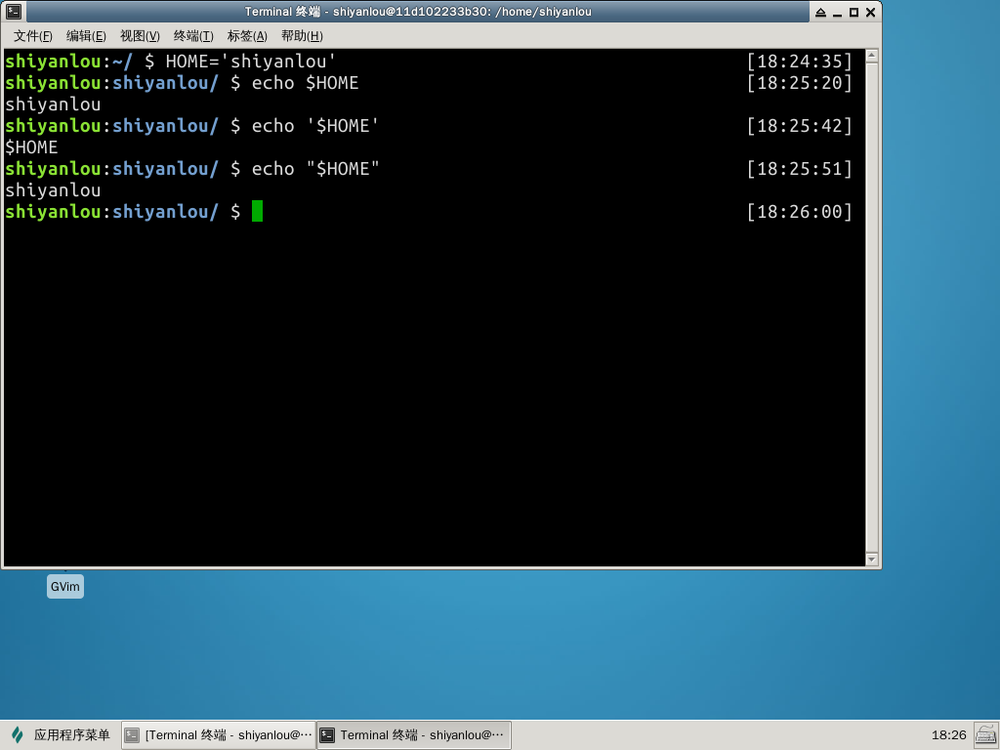

#### 引号

#### 双引号（")

"STRING" 将会阻止（解释）STRING 中大部分特殊的字符。后面的实验会详细说明。

#### 单引号（'）

'STRING' 将会阻止 STRING 中所有特殊字符的解释，这是一种比使用"更强烈的形式。后面的实验会详细说明。

#### 区别

这里举一个例子，能够更加生动的说明：

同样是 `$HOME`，单引号会直接认为是字符，而双引号认为是一个变量。