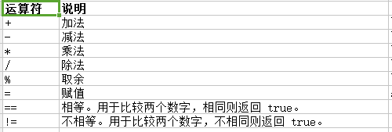

#### [算数运算符]()




> shell中**不支持**像普通c语言中的i++操作，默认都是字符串操作，但是通过以下几种方式可以进行变量的自增加 1、linux 用let 表示算术表达式 如下： i=0 let i +=1 或者 let 'i+=1' 2、let也可以用 (())替代，这种用法常见于for循环中]\

```bash
vim test.sh
#!/bin/bash

a=10
b=20

val=`expr $a + $b`
echo "a + b : $val"

val=`expr $a - $b`
echo "a - b : $val"

val=`expr $a \* $b`
echo "a * b : $val"

val=`expr $b / $a`
echo "b / a : $val"

val=`expr $b % $a`
echo "b % a : $val"

if [ $a == $b ]
then
   echo "a == b"
fi
if [ $a != $b ]
then
   echo "a != b"
fi
```

运行

```bash
bash test.sh

a + b : 30
a - b : -10
a * b : 200
b / a : 2
b % a : 0
a != b
```

> - 原生 bash 不支持简单的数学运算，但是可以通过其他命令来实现，例如 `awk` 和 `expr`，`expr` 最常用。
> - `expr` 是一款表达式计算工具，使用它能完成表达式的求值操作。
> - 注意使用的反引号（esc 键下边）
> - 表达式和运算符之间要有空格 `$a + $b` 写成 `$a+$b` 不行
> - 条件表达式要放在方括号之间，并且要有空格 `[ $a == $b ]` 写成 `[$a==$b]` 不行
> - 乘号（`*`）前边必须加反斜杠（`\`)才能实现乘法运算


