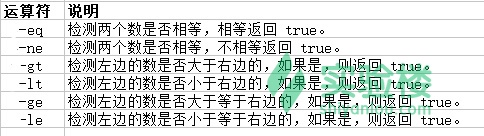

#### 关系运算符


关系运算符只支持数字，不支持字符串，除非字符串的值是数字。



实例

```bash
vim test2.sh
#!/bin/bash

a=10
b=20

if [ $a -eq $b ]
then
   echo "$a -eq $b : a == b"
else
   echo "$a -eq $b: a != b"
fi
```

运行

```bash
bash test2.sh

10 -eq 20: a != b
```

