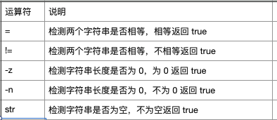

#### 字符串运算符

2022年4月13日18:36:38

---




```bash
#!/bin/bash

a="abc"
b="efg"

if [ $a = $b ]
then
   echo "$a = $b : a == b"
else
   echo "$a = $b: a != b"
fi
if [ -n $a ]
then
   echo "-n $a : The string length is not 0"
else
   echo "-n $a : The string length is  0"
fi
if [ $a ]
then
   echo "$a : The string is not empty"
else
   echo "$a : The string is empty"
fi
```

结果

```bash
abc = efg: a != b
-n abc : The string length is not 0
abc : The string is not empty
```