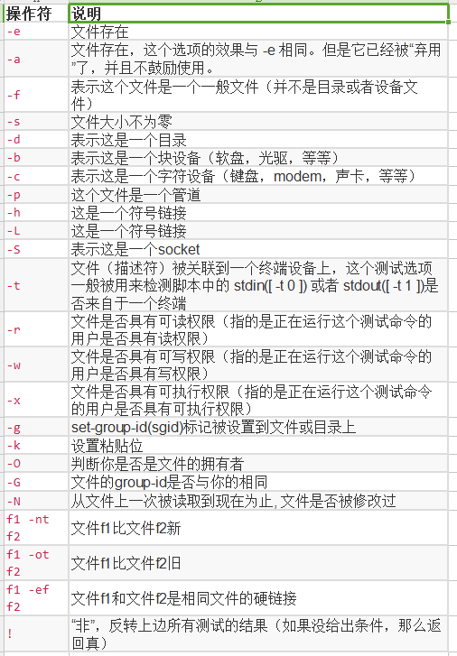

#### 文件测试运算符

2022年4月13日18:52:48

---




实例：

```bash
#!/bin/bash

file="/home/shiyanlou/test.sh"
if [ -r $file ]
then
   echo "The file is readable"
else
   echo "The file is not readable"
fi
if [ -e $file ]
then
   echo "File exists"
else
   echo "File not exists"
fi
```

结果

```bash
The file is readable
File exists
```


下一步