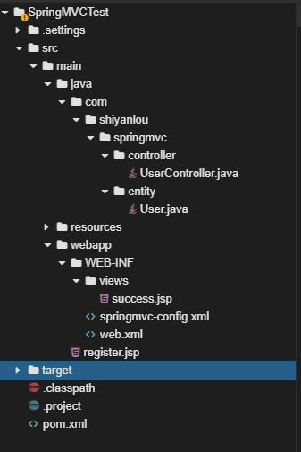
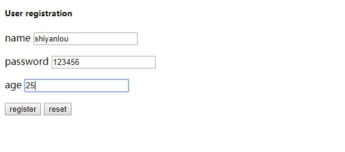
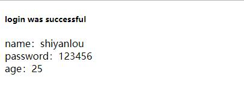

### 实验介绍

2022年5月21日18:24:33

----

本次课程我们将通过一个简单的程序来了解 Spring MVC 的基本用法。

#### 知识点

- Spring MVC 框架
- 注解

#### 实验环境

- Jetty
- JDK
- WEB IDE
- Maven


---

#### 项目文件结构




> 关于在线环境的使用遇到任何问题请查阅使用指南：https://www.lanqiao.cn/questions/89126

---

#### 添加 maven 依赖

打开项目中的 pom.xml 文件，添加必要的 Spring MVC 依赖。

```xml
<project xmlns = "http://maven.apache.org/POM/4.0.0" xmlns:xsi = "http://www.w3.org/2001/XMLSchema-instance"
         xsi:schemaLocation = "http://maven.apache.org/POM/4.0.0 http://maven.apache.org/maven-v4_0_0.xsd">
    <modelVersion>4.0.0</modelVersion>
    <groupId>com.shiyanlou</groupId>
    <artifactId>SpringMVCTest</artifactId>
    <packaging>war</packaging>
    <version>1.0-SNAPSHOT</version>
    <name>SpringMVCTest Maven Webapp</name>
    <url>http://maven.apache.org</url>

    <properties>
        <project.build.sourceEncoding>UTF-8</project.build.sourceEncoding>
        <spring.version>5.1.1.RELEASE</spring.version>
    </properties>

    <dependencies>
        <dependency>
            <groupId>org.springframework</groupId>
            <artifactId>spring-core</artifactId>
            <version>${spring.version}</version>
        </dependency>
        <dependency>
            <groupId>org.springframework</groupId>
            <artifactId>spring-beans</artifactId>
            <version>${spring.version}</version>
        </dependency>
        <dependency>
            <groupId>org.springframework</groupId>
            <artifactId>spring-context-support</artifactId>
            <version>${spring.version}</version>
        </dependency>
        <dependency>
            <groupId>org.springframework</groupId>
            <artifactId>spring-jdbc</artifactId>
            <version>${spring.version}</version>
        </dependency>
        <dependency>
            <groupId>org.springframework</groupId>
            <artifactId>spring-tx</artifactId>
            <version>${spring.version}</version>
        </dependency>
        <dependency>
            <groupId>org.springframework</groupId>
            <artifactId>spring-webmvc</artifactId>
            <version>${spring.version}</version>
        </dependency>

        <dependency>
            <groupId>javax.servlet</groupId>
            <artifactId>javax.servlet-api</artifactId>
            <version>3.1.0</version>
            <scope>provided</scope>
        </dependency>
        <dependency>
            <groupId>javax.servlet.jsp</groupId>
            <artifactId>jsp-api</artifactId>
            <version>2.2</version>
        </dependency>
        <dependency>
            <groupId>javax.servlet</groupId>
            <artifactId>jstl</artifactId>
            <version>1.2</version>
        </dependency>
    </dependencies>
    <build>
        <plugins>
            <plugin>
                <!--jetty maven 插件，为 maven 提供运行 web 程序的能力-->
                <groupId>org.eclipse.jetty</groupId>
                <artifactId>jetty-maven-plugin</artifactId>
                <version>9.4.12.v20180830</version>
                <configuration>
                    <scanIntervalSeconds>10</scanIntervalSeconds>
                    <webApp>
                        <contextPath>/</contextPath>
                    </webApp>
                </configuration>
            </plugin>
        </plugins>
    </build>
</project>
```

---

配置 web.xml 文件


修改 web.xml 文件内容如下：

```xml
<?xml version = "1.0" encoding = "UTF-8"?>
<web-app xmlns:xsi = "http://www.w3.org/2001/XMLSchema-instance"
    xmlns = "http://java.sun.com/xml/ns/javaee" xmlns:web = "http://java.sun.com/xml/ns/javaee/web-app_2_5.xsd"
    xsi:schemaLocation = "http://java.sun.com/xml/ns/javaee http://java.sun.com/xml/ns/javaee/web-app_3_0.xsd"
    id = "WebApp_ID" version = "3.0">
    <display-name>SpringMVCTest</display-name>

    <!-- 配置 Spring MVC DispatchcerServlet 前端控制器 -->
    <servlet>
        <servlet-name>springmvc</servlet-name>
        <servlet-class>org.springframework.web.servlet.DispatcherServlet</servlet-class>
        <init-param>
            <!-- n 是参数名称，该参数的值包含 Spring MVC 的配置文件路径 -->
            <param-name>contextConfigLocation</param-name>
            <param-value>/WEB-INF/springmvc-config.xml</param-value>
        </init-param>
        <!-- 在 Web 应用启动时立即加载 Servlet -->
        <load-on-startup>1</load-on-startup>
    </servlet>
    
    <!-- Servlet 映射声明 -->
    <servlet-mapping>
        <servlet-name>springmvc</servlet-name>
        <!-- 监听当前域的所有请求 -->
        <url-pattern>/</url-pattern>
    </servlet-mapping>
    
    <!-- 添加 register.jsp 为首页 -->
    <welcome-file-list>
        <welcome-file>register.jsp</welcome-file>
    </welcome-file-list>
</web-app>
```

在 web.xml 中配置了 `DispatchcerServlet`，DispatchcerServlet 加载时需要一个 Spring MVC 的配置文件，默认会去 `WEB-INF` 下查找对应的 `[servlet-name]-servlet.xml` 文件，如本例中默认查找的是 `springmvc-servlet.xml`。

Spring MVC 的配置文件可以放在任何地方，用 servlet 的子元素 `init-param` 描述即可，见上述示例代码，这时 DispatchcerServlet 就会去查找 `/WEB-INF/springmvc-config.xml`。

---

#### springmvc-config.xml 文件


在 `webapp/WEB-INF/` 目录下新建 Spring MVC 配置文件 `springmvc-config.xml`，配置 Spring MVC 的 Controller，添加如下代码：

```xml
<?xml version = "1.0" encoding = "UTF-8"?>
<beans xmlns = "http://www.springframework.org/schema/beans"
    xmlns:xsi = "http://www.w3.org/2001/XMLSchema-instance" xmlns:context = "http://www.springframework.org/schema/context"
    xmlns:mvc = "http://www.springframework.org/schema/mvc"
    xsi:schemaLocation = "http://www.springframework.org/schema/beans http://www.springframework.org/schema/beans/spring-beans-4.2.xsd
        http://www.springframework.org/schema/context http://www.springframework.org/schema/context/spring-context-4.2.xsd
        http://www.springframework.org/schema/mvc http://www.springframework.org/schema/mvc/spring-mvc-4.2.xsd">

    <!-- 开启注解 -->
    <mvc:annotation-driven />
    <!-- 配置自动扫描的包，完成 Bean 的创建和自动依赖注入的功能 -->
    <context:component-scan base-package = "com.shiyanlou.springmvc.controller" />
    <!-- 默认静态资源处理 -->
    <mvc:default-servlet-handler/>
    <!-- 配置视图解析器 -->
    <bean id = "viewResolver" class = "org.springframework.web.servlet.view.InternalResourceViewResolver">
        <property name = "prefix" value = "/WEB-INF/views/"></property>
        <property name = "suffix" value = ".jsp"></property>
    </bean>
</beans>
```

上述配置文件中，Spring 使用了扫描机制查找应用程序所有基于注解的控制器类，在本例中，扫描的是 `com.shiyanlou.springmvc.controller` 包及其子包下的所有 Java 文件。

最后配置的视图解析器 InternalResourceViewResolver 用来解析视图，将 View 呈现给用户。视图解析器中配置的 `prefix`表示视图的前缀，`suffix`表示视图的后缀。


下一步

---

实体类 User


在项目目录 `src/main/java` 的包 `com.shiyanlou.springmvc.entity` 下新建类 `User.java`，包含 id、username、password 和 age 属性，代码如下：

```java
package com.shiyanlou.springmvc.entity;

import java.io.Serializable;

public class User implements Serializable {

    private static final long serialVersionUID = 1L;
    private Integer id;
    private String username;
    private String password;
    private Integer age;

    public Integer getId() {
        return id;
    }

    public void setId(Integer id) {
        this.id = id;
    }

    public String getUsername() {
        return username;
    }

    public void setUsername(String username) {
        this.username = username;
    }

    public String getPassword() {
        return password;
    }

    public void setPassword(String password) {
        this.password = password;
    }

    public Integer getAge() {
        return age;
    }

    public void setAge(Integer age) {
        this.age = age;
    }

}
```

#### Controller 类的实现


在包 `com.shiyanlou.springmvc.controller` 下新建 Controller 类 `UserController.java`，具体解释注释已经给出，代码如下：

```java
package com.shiyanlou.springmvc.controller;

import org.springframework.stereotype.Controller;
import org.springframework.ui.Model;
import org.springframework.web.bind.annotation.RequestMapping;

import com.shiyanlou.springmvc.entity.User;

/**
 * UserController 是一个基于注解的控制器
 * 可以同时处理多个请求动作
 */
@Controller
public class UserController {
    /**
     * RequestMapping 用来映射一个请求和请求的方法
     * value = "/register" 表示请求由 register 方法进行处理
     */
    @RequestMapping(value = "/register")
    public String Register(User user, Model model) {  // user:视图层传给控制层的表单对象；model：控制层返回给视图层的对象
        // 在 model 中添加一个名为 "user" 的 user 对象
        model.addAttribute("user", user);
        // 返回一个字符串 " success" 作为视图名称
        return "success";
    }
}
```

#### JSP 页面


**（1）register.jsp**

在 `webapp` 目录下新建一个 JSP 页面命名为 register.jsp，代码如下：

```xml
<%@ page language = "java" contentType = "text/html; charset = UTF-8"
    pageEncoding = "UTF-8"%>
<!DOCTYPE html PUBLIC "-//W3C//DTD HTML 4.01 Transitional//EN" "http://www.w3.org/TR/html4/loose.dtd">
<html>
<head>
<meta http-equiv = "Content-Type" content = "text/html; charset = UTF-8">
<title>register page</title>
</head>
<body>
    <form action = "register" method = "post">
        <h5>User registration</h5>
        <p>
            <label>name </label> <input type = "text" id = "username" name = "username"
                tabindex = "1">
        </p>

        <p>
            <label>password </label> <input type = "text" id = "password" name = "password"
                tabindex = "2">
        </p>

        <p>
            <label>age </label> <input type = "text" id = "age" name = "age"
                tabindex = "3">
        </p>
        <p id = "buttons">
            <input id = "submit" type = "submit" tabindex = "4" value = "register">
            <input id = "reset" type = "reset" tabindex = "5" value = "reset">
        </p>
    </form>
</body>
</html>
```

**（2）success.jsp**

在 `webapp/WEB-INF` 目录下新建文件夹 `views`，并在该路径下新建一个 JSP 页面命名为 success.jsp，代码如下：

```jsp
<%@ page language = "java" contentType = "text/html; charset = UTF-8"
    pageEncoding = "UTF-8"%>
<!DOCTYPE html PUBLIC "-//W3C//DTD HTML 4.01 Transitional//EN" "http://www.w3.org/TR/html4/loose.dtd">
<html>
<head>
<meta http-equiv = "Content-Type" content = "text/html; charset = UTF-8">
<title>success page</title>
</head>
<body>
    <h5>login was successful</h5>
    <p>
        name：${requestScope.user.username}<br /> password：${requestScope.user.password}<br /> age：${requestScope.user.age}<br />
    </p>
</body>
</html>
```

#### 运行测试


打开终端 File -> Open New Terminal。

输入`mvn jetty:run`运行程序，点击`工具--web服务`按钮，访问 spring mvc。 填入数据，点击注册：



结果：



> 注意：目前实验楼只支持 8080 端口启动服务，如果使用其他端口，将无法访问到服务，这里 jetty 默认就是 8080 端口，所以不用更改。