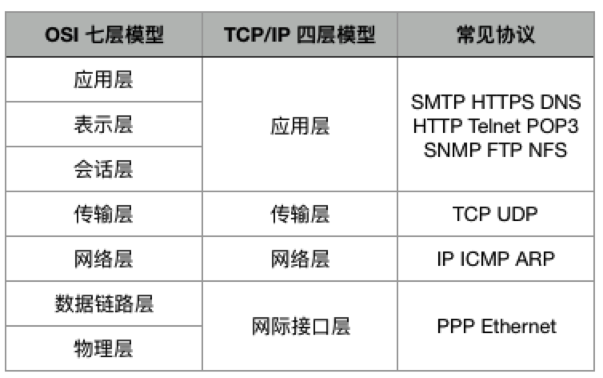
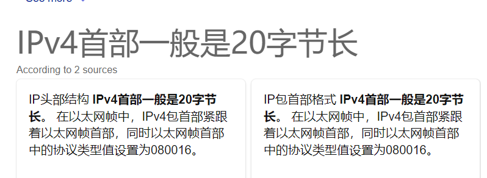
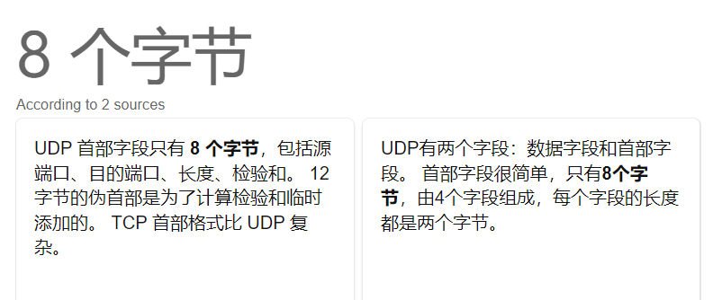
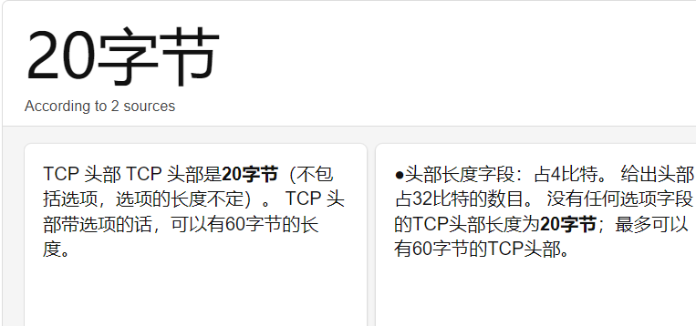

常用协议对应端口号：

| 应用层协议： | FTP   | TELNET | SMTP | DNS  | TFTP | HTTP | SSH  | SNMP |
| ------------ | ----- | ------ | ---- | ---- | ---- | ---- | ---- | ---- |
| 系统端口号： | 20/21 | 23     | 25   | 53   | 69   | 80   | 22   | 161  |

- 应用层：应用程序通过这一层访问网络，常见 FTP、HTTP、DNS 和 TELNET 协议；

- 传输层：TCP 协议和 UDP 协议；

- 网络层：IP 协议，ARP、RARP (ARP的逆向, MAC->IP)协议，ICMP 协议等；

- 网络接口层：是 TCP/IP 协议的基层，负责数据帧的发送和接收。

- 物理层（一层）PDU 指数据位（Bit）

- 数据链路层（二层）PDU 指数据帧（Frame）

- 网络层（三层）PDU 指数据包（Packet）

- 传输层（四层）PDU 指数据段（Segment）

- 第五层以上为数据（data）

- 

- **IP 首部是 20 字节**

- **10 个必需的字段和 1 个可选字段。 报头至少为 20 字节**。

- **UDP首部是8字节**  

  > 下面有图

- 

- **1xx**：通知信息，如收到或正在处理。

- **2xx**：成功接收。

- **3xx**：重定向。

- **4xx**：客户的差错，如 404 表示网页未找到。

- **5xx**：服务器的差错，如常见的 502 Bad Gateway。

| 应用层协议： | FTP  | TELNET | SMTP | DNS  | TFTP | HTTP | SSH  | SNMP |
| ------------ | ---- | ------ | ---- | ---- | ---- | ---- | ---- | ---- |
| 系统端口号： | 21   | 23     | 25   | 53   | 69   | 80   | 22   | 161  |

