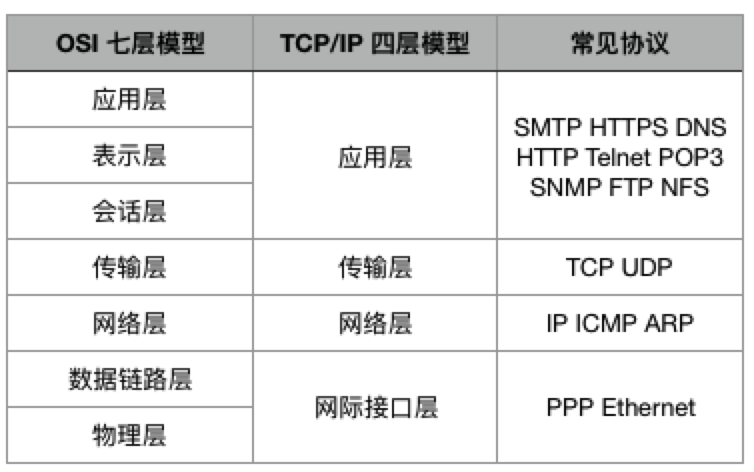

#### 实验介绍

2022年3月25日16:10:34

---

提到网络协议栈结构，最著名的当属 OSI 七层模型，但是 TCP/IP 协议族的结构则稍有不同，它们之间的层次结构有如图对应关系：

可见 TCP/IP 被分为 4 层，每层承担的任务不一样，各层的协议的工作方式也不一样，每层封装上层数据的方式也不一样：

- **应用层：应用程序通过这一层访问网络，常见 FTP、HTTP、DNS 和 TELNET 协议；**
- **传输层：TCP 协议和 UDP 协议；**
- **网络层：IP 协议，ARP、RARP (ARP的逆向, MAC->IP)协议，ICMP 协议等；**
- **网络接口层：是 TCP/IP 协议的基层，负责数据帧的发送和接收。**

本门课程，就是从底向上分层次对 TCP/IP 的各协议做介绍。

#### 知识点

- IP 地址
- 域名
- MAC 地址
- 端口号
- 封装和分用

