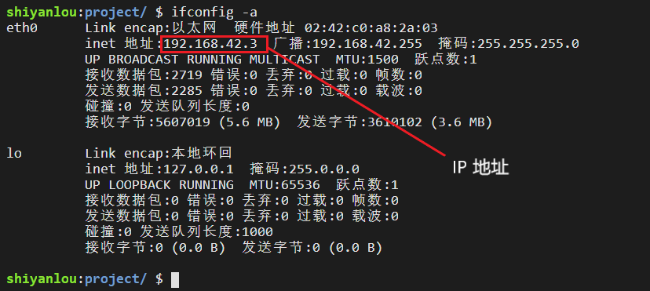

#### IP 地址(网络节点唯一标识符)😛

2022年3月25日16:19:03

---

网络上每一个节点都必须有一个独立的 IP 地址，通常使用的 IP 地址是一个 32bit 的数字，被 `.` 分成 4 组，例如，`255.255.255.255` 就是一个 IP 地址。有了 IP 地址，用户的计算机就可以发现并连接互联网中的另外一台计算机。

在 终端输入 `ifconfig -a` 命令查看自己的 IP 地址：

```bash
ifconfig -a
```



