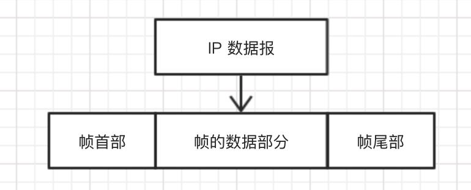

#### 实验简介 ✌️✌️

2022年3月25日16:50:35

---

上一节已经介绍过，网络层协议的数据单元是 **IP 数据报**，而数据链路层的工作就是把网络层交下来的 IP 数据报 封装为**帧**（frame）发送到链路上，以及把接收到的帧中的数据取出并上交给网络层。 为达到这一目的，数据链路必须具备一系列相应的功能，主要有：

- 将数据封装为==帧（frame）==，**帧是数据链路层的传送单位**；
- 控制帧的传输，包括处理传输差错，调节发送速率与接收方相匹配；
- 在两个网络实体之间提供数据链路通路的建立、维持和释放的管理。

数据帧的结构是这样的：

（参考[数据链路层_百度百科](https://baike.baidu.com/item/数据链路层)）

#### 知识点

- 控制帧的传输
- 以太网
- PPP（点对点协议）
- SLIP 与 PPP
- MTU