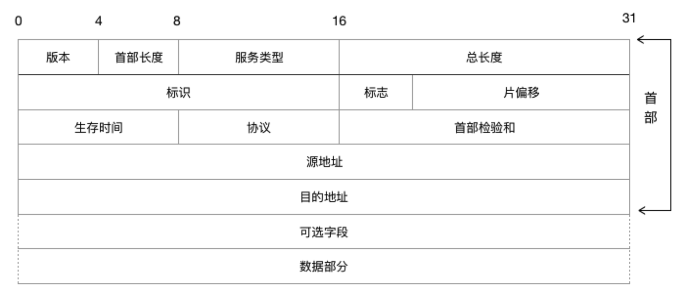
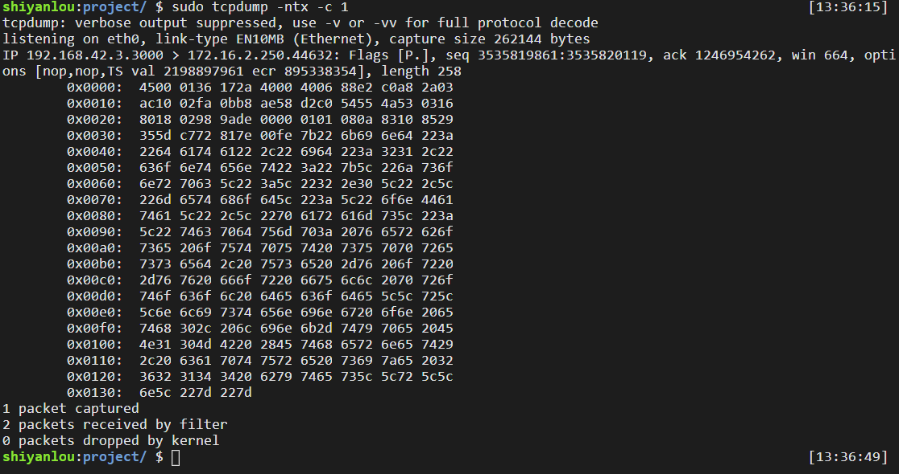

#### IP 数据报  😉😉

2022年4月2日16:40:29

---

我们已经知道了 IP 协议提供的数据传送服务是不可靠和无连接的，具体表现如下：

- `不可靠`（unreliable）：IP 协议不能保证数据报能成功地到达目的地，它仅提供传输服务。当发生某种错误时，IP 协议会丢弃该数据报。传输的可靠性全由上层协议来提供。
- `无连接`（connectionless）：IP 协议对每个数据报的处理是相互独立的。这也说明，IP 数据报可以不按发送顺序接收。如果发送方向接收方发送了两个连续的数据报（先是 A，然后是 B），每个数据报可以选择不同的路线，因此 B 可能在 A 到达之前先到达。

我们先看一下 IP 数据报的格式，其中没有一个字段是多余的，学习 IP 协议就应从学习它的报文字段意义和作用开始。



如上图所示，普通的 IP 数据报的**报头**长度 20 字节(除非有选项字段)，各个部分的作用：

- `版本号`：4 位，用于标明 IP 版本号，0100 表示 IPv4，0110 表示 IPv6。目前常见的是 IPv4。
- `首部长度`：4 位，表示 IP 报头长度，包括选项字段。
- `服务类型(TOS)`：分别有：最小时延、最大吞吐量、最高可靠性、最小花费 4 种服务，如下图所示。4 个标识位只能有一个被置为 1。
- `总长度`：16 位，报头长度加上数据部分长度，便是数据报的总长度。IP 数据报最长可达 `65535` 字节。
- `标识`：16 位，接收方根据分片中的标识字段相不相同来判断这些分片是不是同一个数据报的分片，从而进行分片的重组。通常每发送一份报文它的值就会加 1。
- `标志`：3 位，用于标识数据报是否分片。其中的第 2 位是不分段（DF）位。当 DF 位被设置为 1 时，则不对数据报进行分段处理；第 3 位是分段（MF）位，除了最后一个分段的 MF 位被设置为 0 外，其他的分段的 MF 位均设置为 1。
- `偏移`：13 位，在接收方进行数据报重组时用来标识分片的顺序。
- `生存时间(TTL)`：8 位，用于设置数据报可以经过的最多的路由器个数。TTL 的初始值由源主机设置（通常为 32 或 64），每经过一个处理它的路由器，TTL 值减 1。如果一个数据报的 TTL 值被减至 0，它将被丢弃。
- `协议`：8 位，用来标识是哪个协议向 IP 传送数据。ICMP 为 1，IGMP 为 2，TCP 为 6，UDP 为 17，GRE 为 47，ESP 为 50。
- `首部校验和`：根据 IP 首部计算的校验和码。
- `源 IP 和目的 IP` ：数据报头还会包含该数据报的发送方 IP 和接收方 IP。
- `选项`：是数据报中的一个可变长、可选的信息，不常用，多用于安全、军事等领域。

（参考[TCP/IP 详解：协议(网络层)](https://blog.csdn.net/u014451076/article/details/52821694)）

了解了上面的理论知识过后，我们可以使用 `tcpdump` 这个抓包工具来实际看一下。

```bash
sudo tcpdump -ntx -c 1
```

- `-n` ：显示 IP 地址而非域名地址
- `-t` ：不显示时间戳
- `-x` ：以十六进制显示包内内容
- `-c` ：tcpdump 将在接受到几个数据包后退出



首先看到开头的 `192.168.42.3.3001 > 172.16.2.250.44632` 代表的是源 ip 为 `192.168.42.3`，端口 `3001`，目的 ip 为 `172.16.2.250`，端口 `44632`。

然后看到 `0x0000` 那行：

- 协议版本： `0x4` 表示的是协议版本为 `IPv4`；
- 首部长度： `0x5`，`5*4=20`，表示 IP 报头长度为 20 字节。一个字节通常等于 8 位，所以这里可以知道 IP 报头为 `4500` 到 `2a02`；
- TOS 服务类型：`0x00`，意味着是一般服务；
- 总长度：`0x0136`，换算下来为 `310` 字节；
- 标识：`0x172a`；
- 3bit 标志 + 13bit 片偏移：`0x4000`；
- 生存时间：`0x40`，值为 64；
- 协议：`0x06`，代表 TCP 协议；
- 首部校验和：`0x88e2`。

其他信息可依次类推。