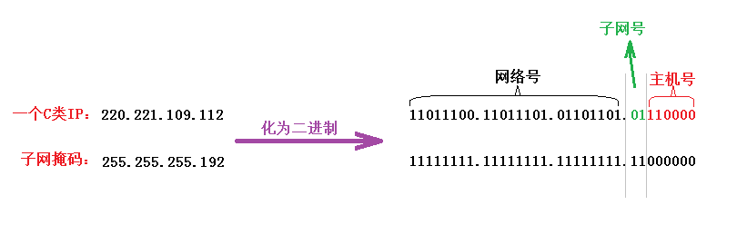
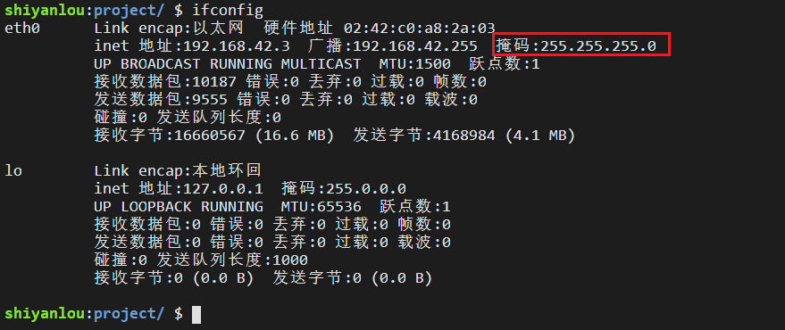

#### 子网划分  😀

2022年4月2日16:59:18

---

**IP 地址如果只使用 ABCDE 类来划分，会造成大量的浪费：一个有 500 台主机的网络，无法使用 C 类地址。但如果使用一个 B 类地址，6 万多个主机地址只有 500 个被使用，造成 IP 地址的大量浪费。**

因此，可以在 ABC 类网络的基础上，进一步划分子网：**占用主机号的前几个位，用于表示子网号**。

这样 IP 地址就可看作 **IP = 网络号 + 子网号 + 主机号**。

子网号的位数没有硬性规定，于是我们用**子网掩码**来确定一个 IP 地址中哪几位是主机号，具体使用方法如图：

> 步骤. 确定网络类型(A 8, B 16, 或C 24)
>
> 子网掩码前缀1的数量减去上述网络类型的网络号长度即子网号长度.
>
> 剩下的值即主机号/

子网掩码中的 1 标识了 IP 地址中相应的网络号和子网号，0 标识了主机号。将 IP 地址和子网掩码进行**逻辑与运算**，结果就能区分网络号和子网号。

使用 `ifconfig` 命令也可以查看到子网掩码：

思考：根据上面所学知识表示出您本机的网络号，子网号，主机号。

