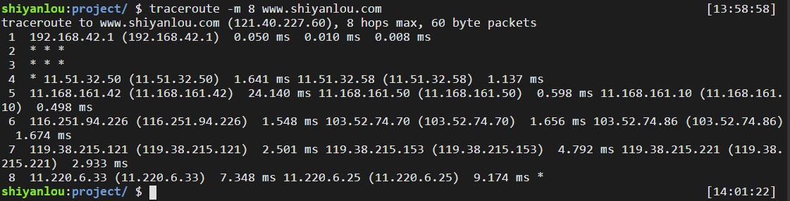

#### IP 路由选择

2022年4月2日17:07:07

---

如果发送方与接收方直接相连（点对点）或都在一个共享网络上（以太网），那么 IP 数据报就能直接送达。

而大多数情况则是发送方与接收方通过若干个路由器(router)连接，那么数据报就需要经过若干个路由器的转发才能送达，它是怎么选择一个合适的路径来"送货"的呢？

IP 层在内存中有一个路由表（输入命令 `route -n` 可以查看路由表），当收到一份数据报并进行发送时，都要对该表进行搜索：

- 搜索路由表，如果能找到和目的 IP 地址完全一致的主机，则将 IP 数据报发向该主机；
- 搜索路由表，如果匹配主机失败，则匹配同子网的路由器(这需要子网掩码的协助)。如果找到路由器，则将该 IP 数据报发向该路由器；
- 搜索路由表，如果匹配同子网路由器失败，则匹配同网络号路由器，如果找到路由器，则将该 IP 数据报发向该路由器；
- 如果以上都失败了，就搜索默认路由，如果默认路由存在，则发报；
- **如果都失败了，就丢掉这个包；**
- 接收到数据报的路由器再按照它自己的路由表继续转发，直到数据报被转发到目的主机；
- **如果在转发过程中，IP 数据报的 TTL（生命周期）已经被减为 0，则该 IP 数据报就被抛弃。**

实验环境中可以使用 `route -n` 查看路由表：


另外我们可以使用 `traceroute` 来追踪路由过程。首先需要安装一下：

```bash
sudo apt-get update
sudo apt-get install -y traceroute
```

接下来使用 `traceroute` 追踪本机到 `www.shiyanlou.com` 的路由：


记录按序列号从 1 开始，每个记录就是一跳，每跳表示一个网关，我们看到每行有三个时间，单位是 ms，这是探测数据包向每个网关发送三个数据包后，网关响应后返回的时间。用这三个时间来表示到达这个结点的网络速度。

我们会看到有一些行是以星号表示的。出现这样的情况，可能是防火墙封掉了 ICMP 的返回信息，所以我们得不到什么相关的数据包返回数据。

还有一些其他选项，比如：

- 设置跳数为 8

```bash
traceroute -m 8 www.shiyanlou.com
```



- 探测包个数设为 4

```bash
traceroute -q 4 www.shiyanlou.com
```


- 显示 IP 地址，不查主机名

```bash
traceroute -n www.shiyanlou.com
```

