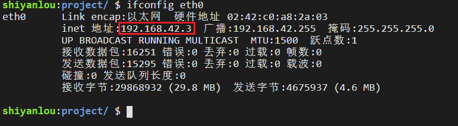

#### NAT 技术(解决内网与外网主机通信)

2022年4月2日17:23:58

---

当你用 ifconfig 查看 IP 地址时，有时你会发现自己的 IP 地址是这样的———192.168.X.X 或 172.16.X.X。这是 C 类网和 B 类网的私有地址，就是俗称的内网 IP。这是因为你的路由器采用了 NAT 技术。

==NAT（Network Address Translation，网络地址转换）==是 1994 年提出的。**当在专用网内部的一些主机本来已经分配到了内网 IP 地址，但现在又想和因特网上的主机通信时，NAT 技术将其内网 IP 地址转换成全球 IP** 地址，然后与因特网连接，也就是说，**内网的数台主机使用了同一个全球 IP 地址在上网。**

**NAT 技术实现了宽带共享，而且有助于缓解 IP 地址空间枯竭的问题。**

使用 `ifconfig eth0` 查看内网 ip：

