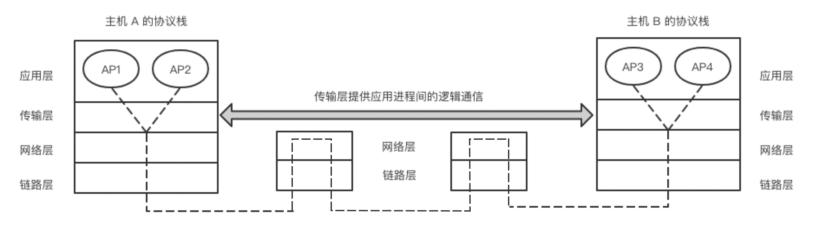

#### 实验步骤  😉😉😉

2022年3月26日13:55:31

---

主机中常常有多个应用进程同时在与外部通信（比如你的浏览器和 QQ 在同时运行），下图中，A 主机的 AP1 进程在与 B 主机的 AP3 进程通信，同时主机 A 的 AP2 进程也在与 B 主机的 AP4 进程通信。

两个主机的传输层之间有一个灰色双向箭头，写着“传输层提供应用进程间的逻辑通信”。

<u>**逻辑通信**：看起来数据似乎是沿着双向箭头在传输层水平传输的，但实际上是沿图中的虚线经多个协议层次而传输。</u>

TCP/IP 协议栈传输层有两个重要协议——UDP 和 TCP，不同的应用进程在传输层使用 TCP 或 UDP 之一。

这一节先介绍比较简单的 UDP，比较复杂的 TCP 将在下一节讨论。

