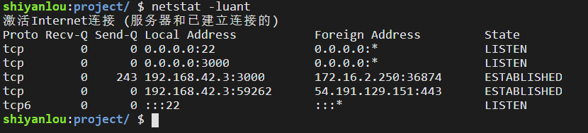

#### 端口 😣 `netstat -luant`

2022年3月26日14:01:38

---

**在第一节我们已经了解过端口的概念，端口的作用体现在传输层。**

刚才的图中，AP1 与 AP3 的通信与 AP2 与 AP4 的通信可以使用同一个传输层协议来传输(TCP 或 UDP)，根据 IP 地址或 MAC 地址都只能把数据传到正确的主机，但具体需要传到哪一个进程，是通过端口来辨认的。

比如同时使用浏览器和 QQ，浏览器占用 80 端口，而 QQ 占用 4000 端口，那么发送过来的 QQ 消息便会通过 4000 端口显示在 QQ 客户端，而不会错误地显示在浏览器上。

端口号有 0 ～ 65535 的编号，其中：

- 编号 0 ～ 1023 为 **系统端口号** ，这些端口号可以在网址 [www.iana.org](http://www.iana.org/) 查询到，它们被指派给了 TCP/IP 最重要的一些应用程序，以下是一些常见的系统端口号：

| 应用层协议： | FTP  | TELNET | SMTP | DNS  | TFTP | HTTP | SNMP |
| ------------ | ---- | ------ | ---- | ---- | ---- | ---- | ---- |
| 系统端口号： | 21   | 23     | 25   | 53   | 69   | 80   | 161  |

- 编号 1024 ～ 49151 为**登记端口号**，为没有系统端口号的应用程序使用，使用这类端口号必须在 IANA 按规定手续登记，以防止重复。
- 编号 49152 ～ 65535 为**短暂端口号**，是留给客户进程选择暂时使用的，使用结束后，这类端口号会被放开以供其它程序使用。

下面使用 `netstat -luant` 命令列出了监听中的端口：

> 其中各选项代表的含义可以使用 `netstat --help` 查看，或者参考 [netstat 命令](http://man.linuxde.net/netstat)

可以看到都是 TCP 协议的。不过后面我们会编写一个程序来模拟发送 UDP 报文，并使用 tcpdump 工具抓包，来帮助大家理解 UDP 协议。