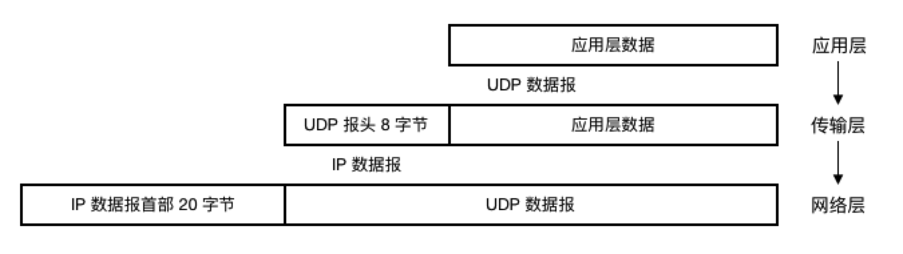

#### UDP 概述

2022年3月26日14:11:52

---

<u>==UDP(User Datagram Protocol)用户数据报协议==，它只在 IP 数据报服务之上增加了很少一点功能，它的主要特点有：</u>

- UDP 是**无连接**的，发送数据之前不需要建立连接(而 TCP 需要)，减少了开销和时延。
- UDP**尽最大努力交付**，不保证交付可靠性。
- UDP 是面向报文的，对于从应用层交付下来的 IP 数据报，只做很简单的封装(8 字节 UDP 报头)，首部开销小。
- **UDP 没有拥塞控制，出现网络拥塞时发送方也不会降低发送速率。这种特性对某些实时应用是很重要的，比如 IP 电话，视频会议等，它们允许拥塞时丢失一些数据，因为如果不抛弃这些数据，极可能造成时延的累积**。
- UDP 支持一对一、一对多、多对一和多对多的交互通信。

> 我们常常进行视频/语言通话若网络不良, 则会出现卡顿, 并且画面会出现跳跃. 这就是数据的丢失, 若不这么做的话, 就会出现严重的延时.

从应用层到传输层，再到网络层的各层次封装：

