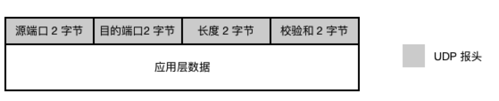
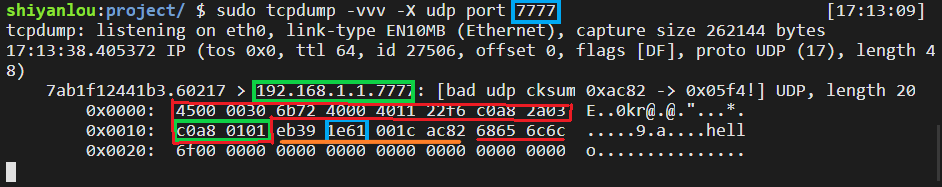

#### UDP 报文

2022年3月26日14:18:35

---

**UDP 数据报可分为两部分：UDP 报头和数据部分。其中数据部分是应用层交付下来的数据。UDP 报头总共 8 字节，而这 8 字节又分为 4 个字段：**



- 源端口：2 字节，在对方需要回信时可用，不需要时可以全 0；
- 目的端口：2 字节，必须，也是最重要的字段；
- 长度：2 字节，长度值包括报头和数据部分；
- 校验和：2 字节，用于检验 UDP 数据报在传输过程中是否有出错，有错就丢弃。

#### tcpdump 抓取 UDP 报文

现在我们动手实践，尝试抓取一个 UDP 数据报，并解读其内容。

我们需要一个小程序，用于向**指定 IP 地址**的**指定端口**发送一个 **指定内容** 的 UDP 数据报，这个程序已经编写好，依次输入以下命令，下载并编译：

```bash
wget https://labfile.oss.aliyuncs.com/courses/98/test.c
gcc -o test test.c
```

这个 C 程序会向 IP 地址 **192.168.1.1** 的 **7777 端口**发送一条 "hello" 消息。你可以用编辑器修改程序，向不同的 IP 发送不同的内容。

编译完成后先别运行，我们还需要使用一个知名的抓包工具 **tcpdump**，依次输入以下命令安装，并运行 tcpdump：

```bash
sudo apt-get update
sudo apt-get install tcpdump
sudo tcpdump -vvv -X udp port 7777
```

新开一个终端，输入以下命令运行刚才编译好的 C 程序 test：

```bash
./test
```

test 程序运行结束，返回刚才运行 tcpdump 的终端查看抓包结果：



蓝色框为 16 进制目的端口，绿色框为 16 进制目的 IP，红色框为 20 字节 IP 报头，橘色下划线为 8 字节 UDP 报头，红色下划线为 hello 的 ASCII 码。

从 `4500` 到 `0101` 都是 IP 报头，IP 报文在之前已经讲过，这里就不赘述了。后面的部分就是 UDP 报文。

我们知道 UDP 报头一共 8 字节，所以从 `eb39` 到 `ac82` 是 UDP 报头的部分。

- `eb39`：源端口，2 字节，换成十进制也就是 `32830`
- `1e61`：目的端口，2 字节，十进制为 `7777`
- `001c`：包长度，单位为字节，换为十进制可知包长度为 28 字节
- `ac82`：校验和

后面的就是数据内容的 ASCII 码。