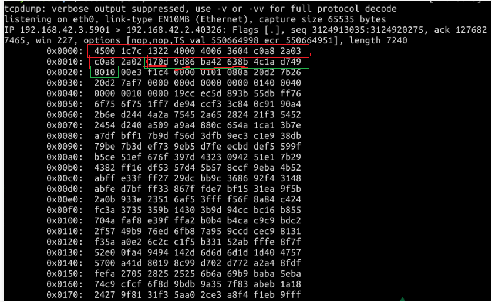

#### TCP 报文段结构  😉😉 `sudo tcpdump -ntx -C 1`

2022年3月26日14:35:47

---

<u>TCP 是面向字节流的，而 TCP 传输数据的单元是 **报文段** 。一个 TCP 报文段可分为两部分：报头和数据部分。数据部分是上层应用交付的数据，而报头则是 TCP 功能的关键。</u>

TCP 报文段的报头有前 20 字节的固定部分，后面 4n 字节是根据需要而添加的字段。如图则是 TCP 报文段结构：


20 字节的固定部分，各字段功能说明：

- `源端口和目的端口`:各占 2 个字节，分别写入源端口号和目的端口号。这和 UDP 报头有类似之处，因为都是传输层协议。

- `序号`:占 4 字节序，序号范围[0，2^32-1]，序号增加到 2^32-1 后，下个序号又回到 0。TCP 是面向字节流的，通过 TCP 传送的字节流中的每个字节都按顺序编号，而报头中的序号字段值则指的是本报文段数据的**第一个字节的序号**。

- `确认序号`:占 4 字节，期望收到对方下个报文段的第一个数据字节的序号。

- `数据偏移`:占 4 位，指 TCP 报文段的报头长度，包括固定的 20 字节和选项字段。

- `保留`:占 6 位，保留为今后使用，目前为 0。

- ```
  控制位
  ```

  :共有 6 个控制位，说明本报文的性质，意义如下：

  - `URG 紧急`:当 URG=1 时，它告诉系统此报文中有紧急数据，应优先传送(比如紧急关闭)，这要与**紧急指针**字段配合使用。
  - `ACK 确认`:仅当 ACK=1 时**确认号**字段才有效。建立 TCP 连接后，所有报文段都必须把 ACK 字段置为 1。
  - `PSH 推送`:若 TCP 连接的一端希望另一端立即响应，PSH 字段便可以“催促”对方，不再等到缓存区填满才发送。
  - `RST复位`:若 TCP 连接出现严重差错，RST 置为 1，断开 TCP 连接，再重新建立连接。
  - `SYN 同步`:用于建立和释放连接，稍后会详细介绍。
  - `FIN 终止`:用于释放连接，当 FIN=1，表明发送方已经发送完毕，要求释放 TCP 连接。

- `窗口`:占 2 个字节。窗口值是指发送者自己的**接收窗口**大小，因为**接收缓存**的空间有限。

  > 表示现在允许对方发送的数据量，也就是告诉对方，**从本报文段的确认号开始允许对方发送的数据量**，达到此值，需要ACK确认后才能再继续传送后面数据，由Window size value * Window size scaling factor（此值在三次握手阶段TCP选项Window scale协商得到）得出此值
  >
  > 引用原文链接：https://blog.csdn.net/wdirdo/article/details/99706085

  版权声明：本文为CSDN博主「Hskds」的原创文章，遵循CC 4.0 BY-SA版权协议，转载请附上原文出处链接及本声明。
  原文链接：https://blog.csdn.net/wdirdo/article/details/99706085

- `检验和`:2 个字节。和 UDP 报文一样，有一个检验和，用于检查报文是否在传输过程中出差错。

- `紧急指针`:2 字节。当 URG=1 时才有效，指出本报文段紧急数据的字节数。

- `选项`:长度可变，最长可达 40 字节。具体的选项字段，需要时再做介绍。

还记得我们在 IP 网际协议抓取的报文吗？我们下面再用 `tcpdump` 命令试着抓取一下。

```bash
sudo tcpdump -ntx -C 1
```



其实输出结果中还包含着 TCP 协议的报文，试着回顾一下，相信你能很快找到哪部分是 IP 协议的首部。IP 报文头紧接着的一部分就是 TCP 报文头，从 `170d` 开始。

> 源端口：`0x170d`，转换为十进制为 5901。
>
> 目的端口：`0x9d86`，即为 40326。
>
> 序号：`0xba42638b`，即为 3124913035，这和图中开头的 seq 是一致的。
>
> 确认序号：`0x4c1ad749`，即为 1276827465，这和图中开头的 ack 是一致的。
>
> 数据偏移：`0x8`，`8*4=32B`。
>
> 其他可依次类推。