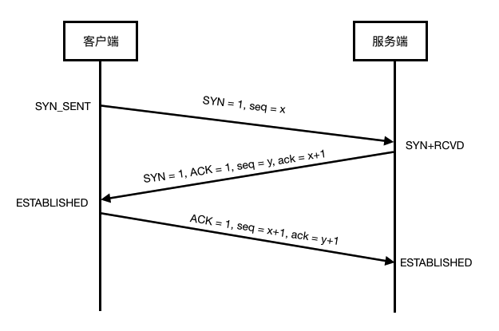
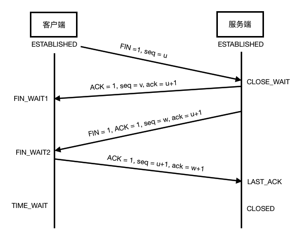
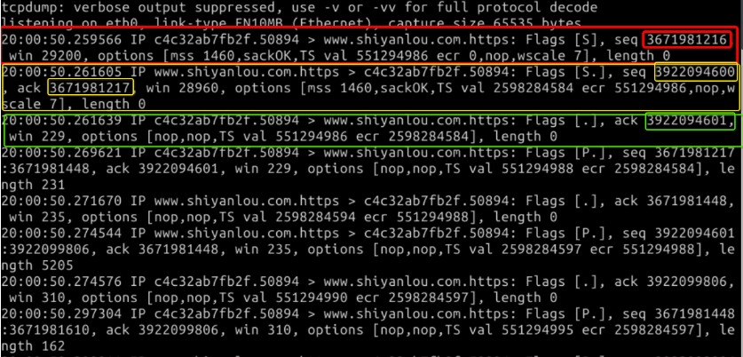

#### 连接的建立与释放  `sudo tcpdump -S host ip0 and ip1` `nslookup`😀😀😀

2022年3月26日15:34:25

---

刚才说过，TCP 是面向连接的，在传输 TCP 报文段之前先要创建连接，发起连接的一方被称为客户端，而响应连接请求的一方被称为服务端，而这个创建连接的过程被称为**三次握手**：



- 客户端发出请求连接报文段，其中报头控制位 SYN=1，初始序号 seq=x。客户端进入 SYN-SENT(同步已发送)状态。
- 服务端收到请求报文段后，向客户端发送确认报文段。确认报文段的首部中 SYN=1，ACK=1，确认号是 ack=x+1，同时为自己选择一个初始序号 seq=y。服务端进入 SYN-RCVD（同步收到）状态。
- 客户端收到服务端的确认报文段后，还要给服务端发送一个确认报文段。这个报文段中 ACK=1，确认号 ack=y+1，而自己的序号 seq=x+1。**这个报文段已经可以携带数据，如果不携带数据则不消耗序号，则下一个报文段序号仍为 seq=x+1**。

至此 TCP 连接已经建立，客户端进入 ESTABLISHED（已建立连接）状态，当服务端收到确认后，也进入 ESTABLISHED 状态，它们之间便可以正式传输数据了。

当传输数据结束后，通信双方都可以释放连接，这个释放连接过程被称为**释放连接**:



- 此时 TCP 连接两端都还处于 ESTABLISHED 状态，客户端停止发送数据，并发出一个 FIN 报文段。首部 FIN=1，序号 seq=u（u 等于客户端传输数据最后一字节的序号加 1）。客户端进入 FIN-WAIT-1（终止等待 1）状态。
- 服务端回复确认报文段，确认号 ack=u+1，序号 seq=v（v 等于服务端传输数据最后一字节的序号加 1），服务端进入 CLOSE-WAIT（关闭等待）状态。现在 TCP 连接处于**半开半闭状态**，服务端如果继续发送数据，客户端依然接收。
- 客户端收到确认报文，进入 FIN-WAIT-2 状态，服务端发送完数据后，发出 FIN 报文段，FIN=1，确认号 ack=u+1，然后进入 LAST-ACK(最后确认)状态。
- 客户端回复确认报文段，ACK=1，确认号 ack=w+1（w 为半开半闭状态时，收到的最后一个字节数据的编号） ，序号 seq=u+1，然后进入 TIME-WAIT（时间等待）状态。

注意此时连接还没有释放，需要时间等待状态结束后（4 分钟）连接两端才会 CLOSED。设置时间等待是因为，有可能最后一个确认报文丢失而需要重传。

我们使用 tcpdump 命令抓包来理解握手过程。首先在终端输入如下命令：

```bash
sudo tcpdump -S host 192.168.42.3 and 115.29.233.149
```

注意：此处的 192.168.42.3 要根据你自己的环境修改，为内网 ip，可以通过 ifconfig eth0 查看。115.29.233.149 是实验楼的网址，需要通过 `nslookup www.shiyanlou` 命令查询最新的 IP 地址。

> 命令目的为抓取本机到 [www.lanqiao.cn](http://www.lanqiao.cn/) 的数据包；
>
> -S 参数的目的是获得 ack 的绝对值。

然后使用浏览器访问 `www.shiyanlou.com`。再回到终端，可以看到如下输出：



输出中展示了三次握手的过程。红色为第一次，黄框是第二次，绿框是第三次，试着根据上面介绍的握手过程来对照 seq 和 ack 值的变化