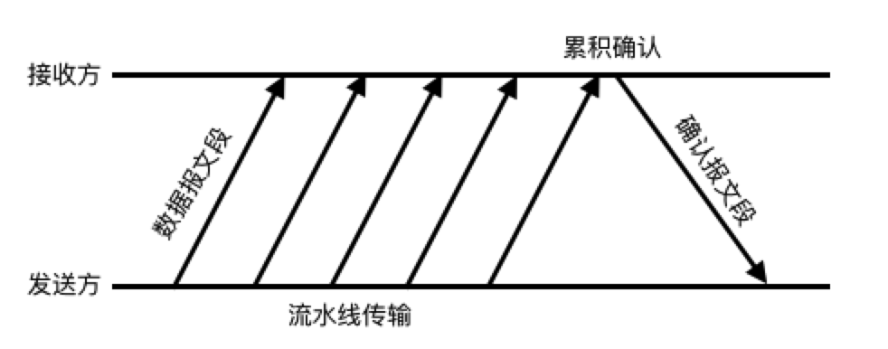

#### 连续 ARQ 协议

2022年3月27日18:16:49

---

也许你也发现了，按上面的介绍，超时重传机制很费时间，每发送一个数据报都要等待确认。

在实际应用中的确不是这样的，真实情况是，采用了**流水线传输**：发送方可以连续发送多个报文段(连续发送的数据长度叫做窗口)，而不必每发完一段就停下来等待确认。

实际应用中，接收方也不必对收到的每个报文都做回复，而是采用**累积确认**方式：接收者收到多个连续的报文段后，只回复确认最后一个报文段，表示在这之前的数据都已收到。

这样，传输效率得到了很大的提升。

