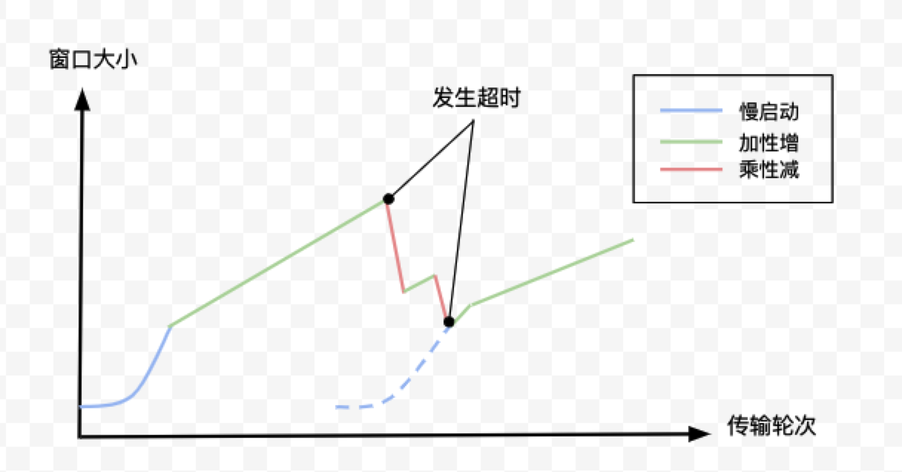
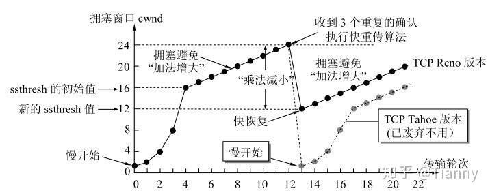
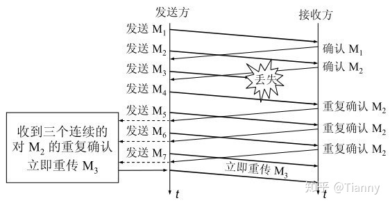

#### 流量控制和拥塞控制   `慢开始`  `拥塞避免` `快重传` `快恢复`😣😣😣

2022年3月27日18:18:04  

---

由于接收方缓存的限制，发送窗口不能大于接收方接收窗口。在报文段首部有一个字段就叫做**==窗口RWND (**Receiver Window**) 滑动窗口==**，这便是用于告诉对方自己的接收窗口，可见窗口的大小是可以变化的。

那么窗口的大小是如何变化的呢？TCP 对于拥塞的控制总结为“慢启动、加性增、乘性减”，如图所示：

- <u>**慢启动** ：初始的窗口值很小，但是按指数规律渐渐增长，直到达到**==慢开始门限(ssthresh)==**。</u>
- <u>**加性增** ：窗口值达到慢开始门限后，每发送一个报文段，窗口值增加一个单位量。</u>
- <u>**乘性减** ：无论什么阶段，只要出现超时，则把窗口值减小一半。</u>

