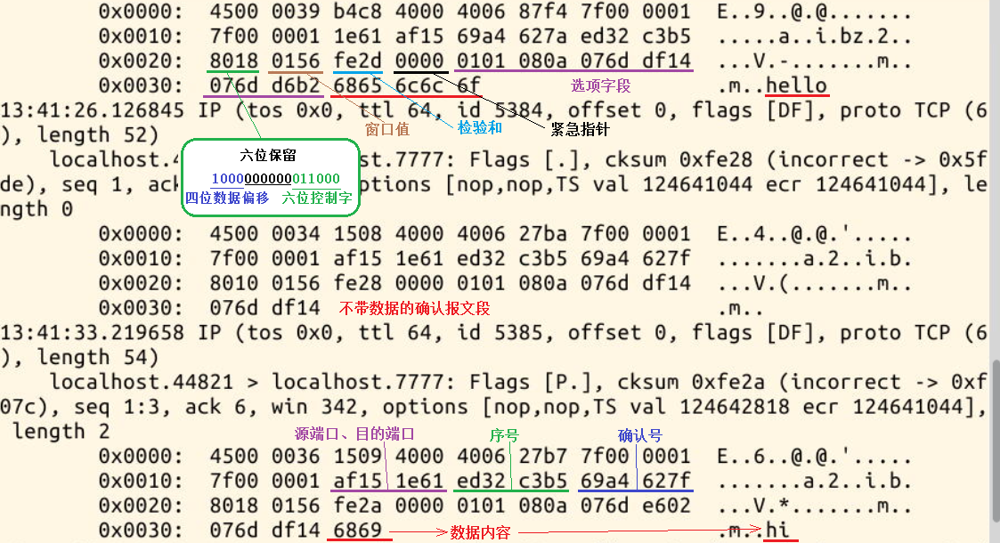

#### tcpdump 抓取 TCP 报文段 😀😀

2022年3月27日18:25:38

---

上一节实验，我们用 tcpdump 抓取并阅读了 UDP 报文，那么这次我们尝试抓取 TCP 报文段。

针对这次实验，需要下载对应的代码文件，是基于 TCP 的聊天小程序，分为 server（服务端—）和 client（客户端）：

```bash
wget https://labfile.oss.aliyuncs.com/courses/98/client.c
wget https://labfile.oss.aliyuncs.com/courses/98/server.c
gcc -o server server.c
gcc -o client client.c
```

编译完成后先不要运行，先打开 tcpdump，使用命令安装并运行 tcpdump：

```bash
sudo apt-get update
sudo apt-get install tcpdump
sudo tcpdump -vvv -X -i lo tcp port 7777
```

新开一个终端，运行 server 程序：

```bash
./server 127.0.0.1
```

然后再新开第三个终端，运行 client 程序：

```bash
./client 127.0.0.1
```

现在，使用 client 和 server 聊天，轮流互发几条简短的消息（比如 hello、hi、wei 之类的）便可以关闭 client 和 server，回到运行 tcpdump 的终端查看抓取的报文段内容：



通过抓取的报文，还可以清晰的看到建立连接三次握手和断开连接四次握手的过程。