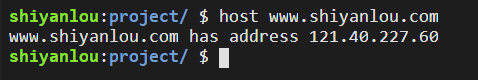
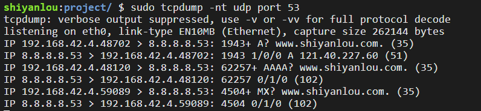
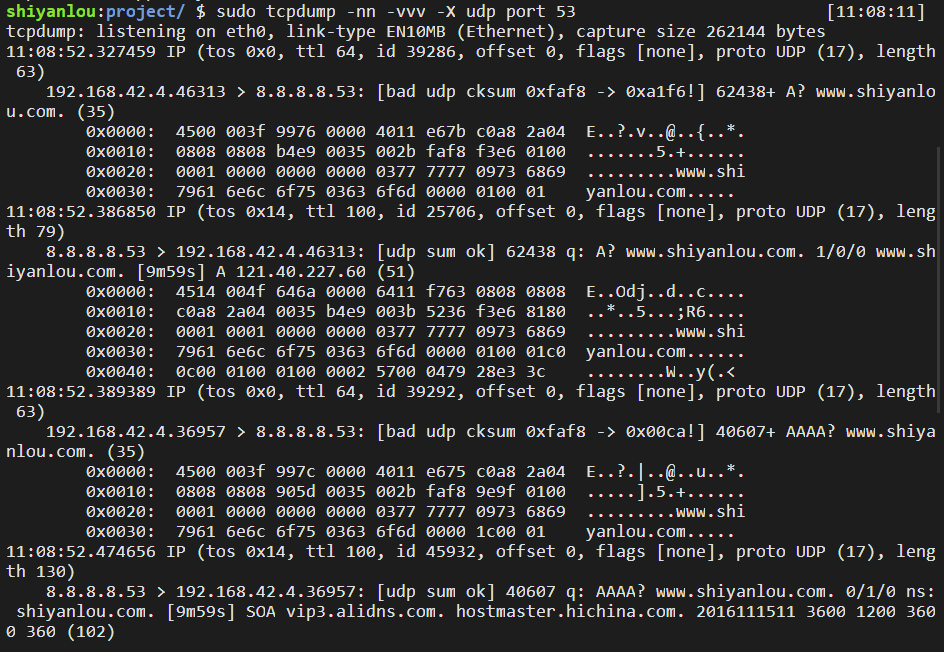

#### CCDNS 协议(简化IP记忆) 😉😉😉

2022年3月25日17:01:16

---

<u>**==DNS（Domain Name Service 域名服务）协议基于 UDP，使用端口号 53。==**</u>

由数字组成的 IP 地址很难记忆，所以我们上网使用网站 IP 地址的别名——域名。实际使用中，域名与 IP 地址是对应的，这种对应关系保存在**DNS 服务器**之中。

在浏览器中输入一个域名后，会有 DNS 服务器将域名解析为对应的 IP 地址。注意这和网络层的 ARP 协议的不同之处：DNS 提供的是域名与 IP 地址的对应关系，而 ARP 提供的是 IP 地址和 MAC 地址的对应关系。

**DNS 服务器**

DNS 服务器是个分层次的系统：

- **根 DNS 服务器** ：全世界共有 13 台根域名服务器，编号 A 到 M，其中大部分位于美国。
- **顶级(TLD)DNS 服务器** ：负责如 com、org、edu 等顶级域名和所有国家的顶级域名（如 cn 、uk 、jp）。
- **权威 DNS 服务器** ：大型组织、大学、企业的域名解析服务。
- **本地 DNS 服务器** ：通常与我们主机最近的 DNS 服务器。

而域名解析的过程，有**迭代查询**和**递归查询**两种方式：


**host 命令**

在 linux 系统中，可以用 **host 命令**进行 DNS 查询，查看一个指定域名的 IP，比如要查询 mirrors.aliyuncs.com 的 IP 地址：

```bash
host mirrors.aliyuncs.com
```

下图示例查询 `www.shiyanlou.com` 的操作，由于实验楼网络限制（非会员用户），只有 `mirrors.aliyuncs.com` 域名可以查询。



**DNS 报文**

<u>主机向 DNS 服务器发出的查询叫做**DNS 报文**</u>，问答报文的内容，都是 IP 和域名的对应信息，问题中包含域名，类型，类信息，回答中包含指针，类型，类，TTL，长度，IP 地址信息。

**DNS 缓存和 hosts 文件**

之前 DNS 解析查询过程的图中，共发出了 8 份 DNS 报文，这是非常消耗时间的，所以实际应用上使用 <u>**DNS 缓存 ：当一个 DNS 服务器接收到一个 DNS 回答后，会将其信息缓存一段时间，当再有一个对相同域名的查询时，便可直接回复。**</u>

通过 DNS 缓存，其实很多查询都只需要本地 DNS 服务器便可完成。

我们可以用 `dig` 命令进行域名查询：

```bash
# 查询 www.lanqiao.cn 的 ip 地址，+noedns 是不显示 edns 信息
dig www.lanqiao.cn +noedns
```

输出信息解析：

```bash
# 这一部分为应答的统计信息
# - QUERY：查询任务个数，这里为 1 个
# - ANSWER：查询到几条 A 记录（IP 地址），这里为 1 条
# - AUTHORITY：几个权威域名服务器，这里为 0 个
# - ADDITIONAL：几个附加信息，这里为 0 个
; <<>> DiG 9.9.5-3ubuntu0.8-Ubuntu <<>> www.lanqiao.cn +noedns
;; global options: +cmd
;; Got answer:
;; ->>HEADER<<- opcode: QUERY, status: NOERROR, id: 28554
;; flags: qr rd ra; QUERY: 1, ANSWER: 1, AUTHORITY: 0, ADDITIONAL: 0


# 这一部分为问题片段，意思是查询 www.lanqiao.cn 的 A 记录
;; QUESTION SECTION:
;www.shiyanlou.com.        IN    A

# 这一部分为应答片段，意为查询到的 IP 为 115.29.233.149
;; ANSWER SECTION:
www.shiyanlou.com.    43200    IN    A    115.29.233.149

# 这一部分为查询的任务统计信息，比如查询花了多少时间，执行查询的时间等
;; Query time: 8 msec
;; SERVER: 100.100.2.138#53(100.100.2.138)
;; WHEN: Sun Feb 03 17:37:46 CST 2019
;; MSG SIZE  rcvd: 51
```

我们下面用 tcpdump 来捕获 DNS。首先执行命令：

```
sudo tcpdump -nt udp port 53
```

> 53 端口是 DNS 服务器所开放的端口

这个时候并没有什么捕获信息，因为我们还没有开始 DNS 查询。可以使用 `host` 命令进行域名查询，我们**新开一个终端标签**执行：

```
$ host www.shiyanlou.com
```

回到之前的标签，可以看到 tcpdump 命令的输出：



我们来看第一个数据包，是由本机向首选 DNS 服务器 `8.8.8.8` 的 `53` 端口发送的 DNS 查询报文。`1943` 是查询报文的标识值。`+` 代表启用递归查询标志。`A?` 表示使用 A 类型的查询方式。`www.shiyanlou.com` 为查询的域名。`35` 代表 DNS 查询报文的长度为 35 字节。

第二个数据包为应答报文，可以看出标识值和第一个报文的标识值是一样的，`1/0/0` 表示报文包含 1 个应答资源记录，0 个授权资源记录，0 个额外信息记录。`51` 代表应答报文的长度为 51 字节。

同理可得出后续报文所代表的含义。

我们还可以使用如下命令查看以十六进制输出的报文内容：

```
sudo tcpdump -nn -vvv -X udp port 53
```

> 注意：要新开一个终端使用 `host www.shiyanlou.com` 查询域名 IP 后才可见输出。



我们来看第一个数据报，呈现的报文内容实际上是 IP 数据报，包含了 IP 首部，UDP 首部和 DNS 报文，**根据之前的学习我们知道 IP 首部是 20 字节，**也就是 `4500` 到 `0808` 的部分，**UDP 首部是 8 字节，**也就是 `b4e9` 到 `faf8` 的部分。剩下的也就是 DNS 请求报文，一共 35 字节，与括号中的 35 是吻合的。同理可解析其他报文信息。

