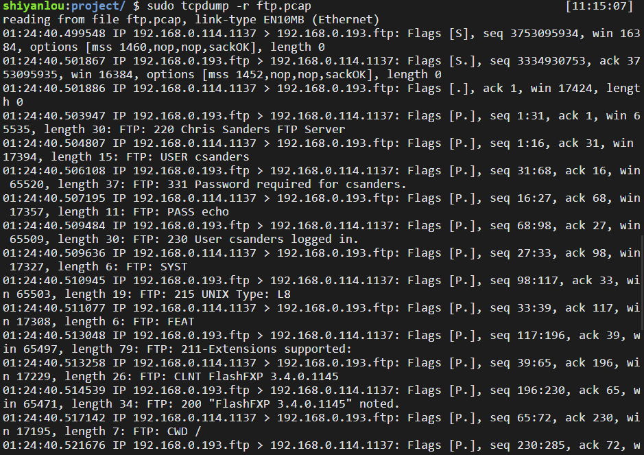
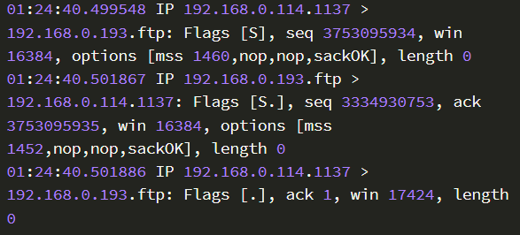
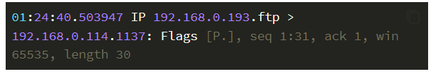

**FTP 协议 (文件传输)**

2022年3月25日17:27:39

---

<u>**==FTP（File Transfer Protocol 文件传输协议）基于 TCP，使用端口号 20（数据）和 21（控制)==。**</u>

它的主要功能是减少或消除在不同操作系统下处理文件的不兼容性，以达到便捷高效的文件传输效果。

- FTP 只提供文件传输的基本服务，它采用 客户端—服务器 的方式，一个 FTP 服务器可同时为多个客户端提供服务。
- **在进行文件传输时，FTP 的客户端和服务器之间会建立两个 TCP 连接：21 号端口建立控制连接，20 号端口建立数据连接**。
- FTP 的传输有两种方式：ASCII 传输模式和二进制数据传输模式。

我们直接下载一个 FTP 报文信息示例包 `ftp.pcap`，然后用 tcpdump 解析。

```
# 下载 ftp.pcap 文件
wget https://labfile.oss.aliyuncs.com/courses/98/ftp.pcap

# 用 tcpdump 命令解析
sudo tcpdump -r ftp.pcap
```



> - src-ip.src-port > dest-ip.dest-port: Flags[S]
> - [S] – SYN (开始连接 (同步))
> - [.] – 没有标记
> - [P] – PSH (数据推送)
> - [F] – FIN (结束连接)
> - [R] – RST (重启连接)
> - 源地址位于 `>` 前面，后面则是目的地址。你可以把 `>` 想象成一个指向目的地址的箭头符号

```
shiyanlou:project/ $ sudo tcpdump -r ftp.pcap | grep -n "length 0"                                                  [19:23:29]
reading from file ftp.pcap, link-type EN10MB (Ethernet)
1    :01:24:40.499548 IP 192.168.0.114.1137 > 192.168.0.193.ftp: Flags [S], seq 3753095934, win 16384, options [mss 1460,nop,nop,sackOK], length 0
2    :01:24:40.501867 IP 192.168.0.193.ftp > 192.168.0.114.1137: Flags [S.], seq 3334930753, ack 3753095935, win 16384, options [mss 1452,nop,nop,sackOK], length 0
3    :01:24:40.501886 IP 192.168.0.114.1137 > 192.168.0.193.ftp: Flags [.], ack 1, win 17424, length 0


19   :01:24:40.674666 IP 192.168.0.114.1137 > 192.168.0.193.ftp: Flags [.], ack 316, win 17109, length 0
20   :01:24:40.844895 IP 192.168.0.114.4844 > 63.245.209.21.http: Flags [F.], seq 815701887, ack 4216269512, win 16755, length 0
21   :01:24:40.949327 IP 63.245.209.21.http > 192.168.0.114.4844: Flags [F.], seq 1, ack 1, win 8190, length 0
22   :01:24:40.949353 IP 192.168.0.114.4844 > 63.245.209.21.http: Flags [.], ack 2, win 16755, length 0


29   :01:24:43.163553 IP 192.168.0.114.1140 > 192.168.0.193.7254: Flags [S], seq 464133708, win 32768, options [mss 1460,nop,nop,sackOK], length 0
30   :01:24:43.164508 IP 192.168.0.193.7254 > 192.168.0.114.1140: Flags [S.], seq 3937374868, ack 464133709, win 16384, options [mss 1452,nop,nop,sackOK], length 0
31   :01:24:43.164521 IP 192.168.0.114.1140 > 192.168.0.193.7254: Flags [.], ack 1, win 32768, length 0
```

前面三帧是客户端与服务器的三次握手，连接服务端的 ftp 端口（21），客户端 ip 是 192.168.0.114，服务端 ip 是 192.168.0.193：

```
01:24:40.499548 IP 192.168.0.114.1137 > 192.168.0.193.ftp: Flags [S], seq 3753095934, win 16384, options [mss 1460,nop,nop,sackOK], length 0
01:24:40.501867 IP 192.168.0.193.ftp > 192.168.0.114.1137: Flags [S.], seq 3334930753, ack 3753095935, win 16384, options [mss 1452,nop,nop,sackOK], length 0
01:24:40.501886 IP 192.168.0.114.1137 > 192.168.0.193.ftp: Flags [.], ack 1, win 17424, length 0
```



第四帧是服务器向客户端发送相关信息：

```
01:24:40.503947 IP 192.168.0.193.ftp > 192.168.0.114.1137: Flags [P.], seq 1:31, ack 1, win 65535, length 30
```



此时控制连接建立完成。再下面的部分就是客户端向服务器端发送请求，然后服务器端响应客户端的过程，比如登录，输出所在路径等操作。

在后面的输出中，还能找到客户端与服务器端建立数据连接时三次握手的过程。

我们这里看到服务器端开放端口号不是 20 是因为 FTP 的工作模式是被动模式（PASV），被动模式中，服务端会创建一个新的随机的非特权端口 P（P> = 1023）与客户端建立数据通道连接。


