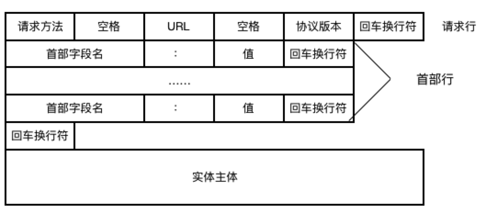
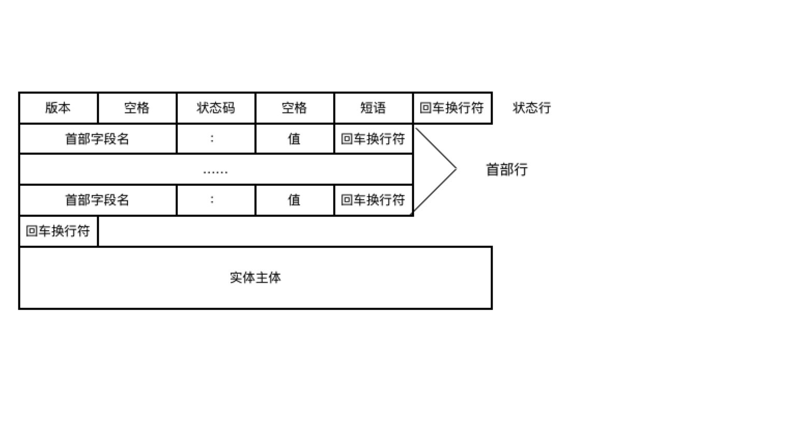
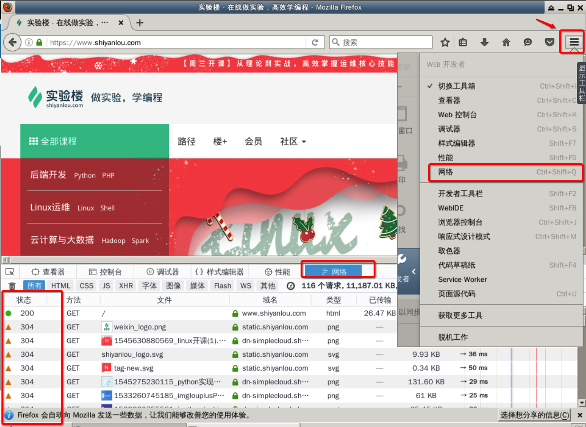
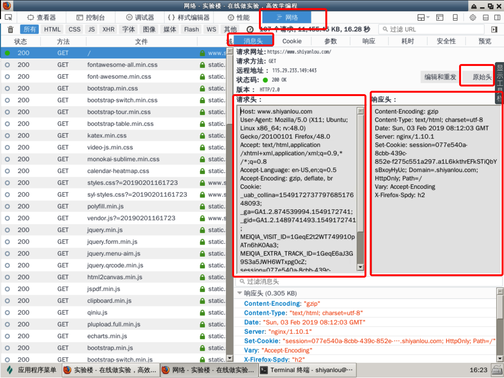

#### HTTP 协议( 使用频率最大) 😉😉

2022年3月25日19:42:48

----

**<u>==HTTP (HyperText Transfer Protocol 超文本传输协议) 基于 TCP，使用端口号 80 或 8080。==</u>**

每当你在浏览器里输入一个网址或点击一个链接时，浏览器就通过 HTTP 协议将网页信息从服务器提取再显示出来，这是现在使用频率最大的应用层协议。

这个原理很简单：

- 点击一个链接后，浏览器向服务器发起 TCP 连接；
- 连接建立后浏览器发送 HTTP 请求报文，然后服务器回复响应报文；
- 浏览器将收到的响应报文内容显示在网页上；
- 报文收发结束，关闭 TCP 连接。

**HTTP 报文会被传输层封装为 TCP 报文段，然后再被 IP 层封装为 IP 数据报。**

HTTP 请求报文结构：

HTTP 响应报文结构：

可见报文分为 3 部分：

- 开始行：用于区分是请求报文还是响应报文，请求报文中开始行叫做**请求行**，而响应报文中，开始行叫做**状态行**。在开始行的三个字段之间都用空格分开，结尾处 CRLF 表示回车和换行。
- 首部行：用于说明浏览器、服务器或报文主体的一些信息。
- 实体主体：请求报文中通常不用实体主体。

请求报文的**方法字段**是对所请求对象进行的操作，而响应报文的**状态码**是一个 3 位数字，分为 5 类 33 种：

- **1xx**：通知信息，如收到或正在处理。
- **2xx**：成功接收。
- **3xx**：重定向。
- **4xx**：客户的差错，如 404 表示网页未找到。
- **5xx**：服务器的差错，如常见的 502 Bad Gateway。

我们可以通过浏览器的开发者工具来查看状态码，首先使用浏览器访问 [www.lanqiao.cn](http://www.lanqiao.cn/) ，然后通过如下图所示打开浏览器控制台，然后刷新页面，在网络标签里我们可以看到对应资源的获取状态码。

我们随意点击一个记录，然后点击消息头即可看到消息头的信息：

开发者工具对消息做了一些处理，使输出更为易读，如果我们想查看原始头的信息，可以点击原始头按钮。

可以看到消息的请求头和响应头，请求头里包含请求的网址，请求方法，协议版本等。响应头里包含了消息类型，编码，时间等信息。