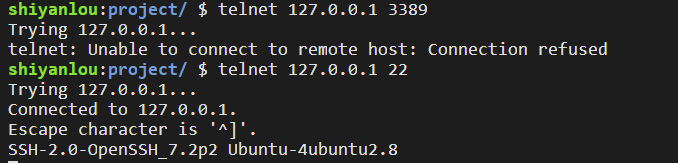
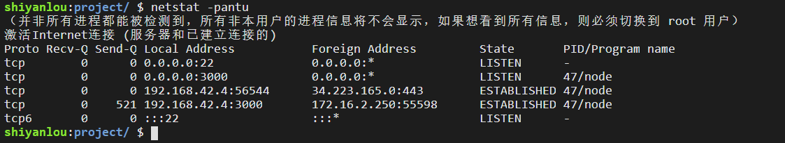

#### Telnet 协议 (远程登录)🤔🤔

2022年3月25日20:19:21

-----

下面我们将会学习 Telnet 协议。

#### Telnet 简介

<u>**Telnet 协议是 TCP/IP 协议族中的一员，是 Internet 远程登录服务的标准协议和主要方式，它基于 TCP 协议，使用端口 23。**</u>

终端使用者在本地电脑上使用 telnet 程序，用它连接到服务器，终端使用者可以在 telnet 程序中输入命令，这些命令会在服务器上运行，就像直接在服务器的控制台上输入一样。

#### Telnet 工作过程

使用 Telnet 协议进行远程登录时必须满足以下条件:

- 在本地计算机上必须装有包含 Telnet 协议的客户程序；
- 必须知道远程主机的 IP 地址或域名；
- 必须知道登录标识与口令。

Telnet 远程登录服务分为以下 4 个过程 😣😣:

- 本地与远程主机建立连接。该过程实际上是*建立一个 TCP 连接*，用户必须知道远程主机的 IP 地址或域名；
- **将本地终端上输入的用户名和口令及以后输入的任何命令或字符以 ==NVT ( Net Virtual Terminal )== 格式传送到远程主机。该过程实际上是从本地主机向远程主机发送一个 IP 数据包；**
- 将远程主机输出的 NVT 格式的数据转化为本地所接受的格式送回本地终端，包括输入命令回显和命令执行结果；
- 最后，本地终端对远程主机进行撤消连接。该过程是*撤销一个 TCP 连接*。

> 可见Telnet协议, 充当媒介, 把数据包装成NVT格式, 或者把对方发回NVT格式转化本地可识别格式.

（参考[Telnet_百度百科](https://baike.baidu.com/item/Telnet/810597?fr=aladdin)）

#### Telnet 连接远程主机

telnet 使用语法：`telnet IP 端口（可选）`。

```bash
shiyanlou:~/ $ telnet 127.0.0.1 22
Trying 127.0.0.1...
Connected to 127.0.0.1.
Escape character is '^]'.
SSH-2.0-OpenSSH_6.6.1p1 Ubuntu-2ubuntu2.8
```

#### Telnet 测试主机端口

telnet 可以测试目标机器的 TCP 端口是否开放。

例如 `telnet IP地址 3389` 是用来测试目标机器的 3389 端口是否开放，如果连接失败，可能是以下原因：

- 防火墙屏蔽
- 目标机器没有启用相关远程桌面服务（windows）
- 修改了默认占用 3389 端口。

下图示例使用 `telnet 127.0.0.1 端口` 测试本地环境端口开放性：



说明本地环境 3389 端口未开放 ，22 端口开放。

下图示例使用 `netstat -pantu` 验证以上结果（LISTEN 说明为开放状态）：


