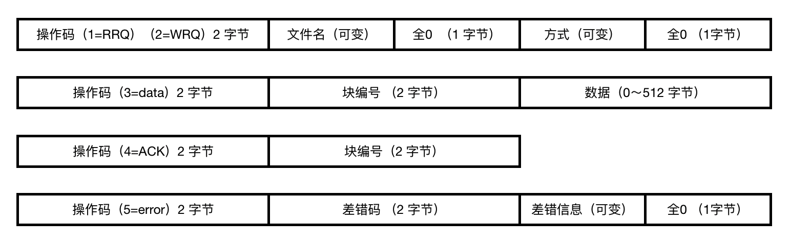

#### TFTP 协议 (专为小文件,FTP lite!)😛😛😛

2022年3月25日20:53:58  

----

下面我们将会学习 TFTP 协议。

#### TFTP 简介

<u>**==TFTP（ Trivial File Transfer Protocol ）==是 TCP/IP 协议族中的一个用来在客户机与服务器之间进行简单文件传输的协议，提供不复杂、开销不大的文件传输服务，它基于 UDP 协议，使用端口 69 。**</u>

**此协议设计的时候是进行小文件传输的，与 FTP 相比少了许多功能**，**它只能从文件服务器上获得或写入文件，不能列出目录，不进行认证**。

TFTP 也有着它自身的优点：

- TFTP 可用于 UDP 环境；比如当需要将程序或者文件同时向许多机器下载时就往往需要使用到 TFTP 协议。
- TFTP 代码所占的内存较小，这对于小型计算机或者某些特殊用途的设备来说是很重要的，TFTP 具有更多的灵活性，也减少了开销。

#### TFTP 报文格式(大小可变)

TFTP 数据报文有 5 种操作码，对应了 5 种报文格式（1、2 报文格式相同）：

- 操作码为 RRQ ：读文件请求，客户端请求读取位于服务器上的文件；
- 操作码为 WRQ ：写文件请求，客户端请求写入位于服务器上的文件；
- 操作码为 DATA ：数据包，用于传输数据文件；
- 操作码为 ACK ：确认包，回应确认信息；
- 操作码为 ERROR ：错误包，它用于服务器不能处理读请求或者写请求的情况。