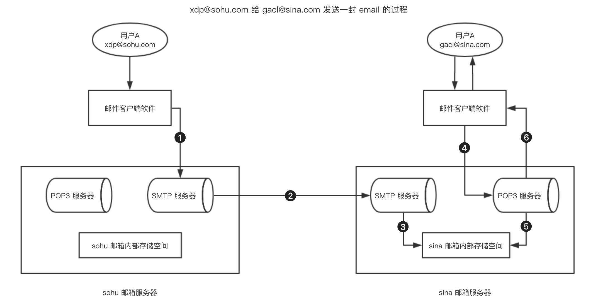

#### SMTP 协议和 POP3 协议 (邮件的接收)

2022年3月25日21:08:52

---

下面我们将会学习 SMTP 协议和 POP3 协议。

#### SMTP 简介

**<u>==SMTP（Simple Mail Transfer Protocol）==即简单邮件传输协议，它是一组用于由源地址到目的地址传送邮件的规则，由它来控制信件的中转方式,它使用 TCP 协议，使用端口 25。</u>**

> 协议 : xxxx…的规则.

SMTP 存在两个端：

- 在发信人的邮件服务器上执行的客户端；
- 在收信人的邮件服务器上执行的服务器端。

**SMTP 的客户端和服务器端同时运行在每个邮件服务器上。**当一个邮件服务器在向其它邮件服务器发送邮件消息时，它是作为 SMTP 客户在运行。

> 客户 :即发送方
>
> 服务:接收端

#### SMTP 的连接和发送过程

- 建立 TCP 连接
- 客户端向服务器发送 HELO(被EHLO取代😣) 命令以标识发件人自己的身份，然后客户端发送 MAIL 命令
- 服务器端以 OK 作为响应，表示准备接收
- 客户端发送==**RCPT** (Reception)== 命令  😛
- 服务器端表示是否愿意为收件人接收邮件
- 协商结束，发送邮件，用命令 DATA 发送输入内容
- 结束此次发送，用 QUIT 命令退出

邮件服务器收到`**EHLO**`命令以后，不仅会返回`250`状态码，还会返回自己支持的各种扩展的列表。

> ```bash
> 250-mx.google.com at your service, [114.84.160.153]
> 250-SIZE 157286400
> 250-8BITMIME
> 250-STARTTLS
> 250-ENHANCEDSTATUSCODES
> 250-PIPELINING
> 250-CHUNKING
> 250 SMTPUTF8
> ```

[SMTP 协议详解及工作过程](https://blog.csdn.net/kerry0071/article/details/28604267)

```shell
C: telent SMTP.163.com 25  //以telenet方式连接163邮件服务器
S: 220 163.com Anti-spam GT for Coremail System //220为响应数字，其后的为欢迎信息
C: HELO SMTP.163.com //除了HELO所具有的功能外，EHLO主要用来查询服务器支持的扩充功能 
S: 250-mail
S: 250-AUTH LOGIN PLAIN
S: 250-AUTH=LOGIN PLAIN
S: 250 8BITMIME //最后一个响应数字应答码之后跟的是一个空格，而不是'-' 
C: AUTH LOGIN   //请求认证
S: 334 dxNlcm5hbWU6  //服务器的响应——经过base64编码了的“Username”=
C: Y29zdGFAYW1heGl0Lm5ldA==  //发送经过BASE64编码了的用户名
S: 334 UGFzc3dvcmQ6  //经过BASE64编码了的"Password:"=
C: MTk4MjIxNA==  //客户端发送的经过BASE64编码了的密码
S: 235 auth successfully  //认证成功 
C: MAIL FROM: bripengandre@163.com  //发送者邮箱
S: 250 … .  //“…”代表省略了一些可读信息
C: RCPT TO: bripengandre@smail.hust.edu.cn　//接收者邮箱
S: 250 … .    // “…”代表省略了一些可读信息
C: DATA //请求发送数据
S: 354 Enter mail, end with "." on a line by itself
C: Enjoy Protocol Studing
C: .
S: 250 Message sent
C: QUIT //退出连接 
S: 221 Bye
```


------------------------------------------------


#### POP3 简介

<u>**==POP3（Post Office Protocol Version 3 ）==即邮局协议版本 3，是 TCP/IP 协议族中的一员 ，主要用于支持使用客户端远程管理在服务器上的电子邮件，使用 TCP 协议，使用端口 110 。**</u>

POP3 邮件服务器大都可以“只下载邮件，服务器端并不删除”，也就是改进的 POP3 协议。

#### POP3 工作过程

- 用户运行用户代理（如 Foxmail, Outlook Express）
- 用户代理（以下简称客户端）与邮件服务器（以下简称服务器端）的 110 端口建立 TCP 连接
- **客户端向服务器端发出各种命令，来请求各种服务（如查询邮箱信息，下载某封邮件等）** 😀
- **服务端解析用户的命令，做出相应动作并返回给客户端一个响应**
- 上述的两个步骤交替进行，直到接收完所有邮件转到下一步，或两者的连接被意外中断而直接退出
- 用户代理解析从服务器端获得的邮件，以适当地形式（如可读）的形式呈现给用户. (一般浏览器即用户代理)😛

（参考[邮件服务器之 POP3 协议分析](https://www.cnblogs.com/foxmin/archive/2011/10/16/2214425.html)）

#### POP3 和 SMTP 协同工作

一封邮件的发送过程：




1. 通过 smtp 协议连接到 smtp 服务器，然后发一封邮件给 sohu 的 smtp 服务器；
2. 通过 smtp 协议将邮件转投给 sina 的 smtp 服务器（邮件发送服务器）；
3. 将接收到的邮件存储到 [gacl@sina.com](mailto:gacl@sina.com) 这个邮件账号分配的存储空间中；
4. 通过 POP3 协议连接到 POP3 服务器收取邮件；
5. 从 [gacl@sina.com](mailto:gacl@sina.com) 账号的存储空间当中取出邮件；
6. POP3 服务器将取出来的邮件回送给 [gacl@sina.com](mailto:gacl@sina.com) 账户。

