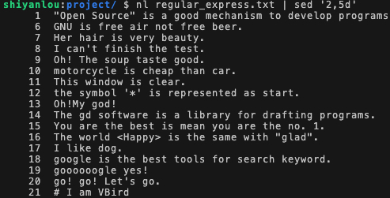

#### 输出文件内容 😉 d ‘m, nd’


将 regular_express.txt 的内容列出并打印行号，并将 2-5 行删除显示：

```bash
nl regular_express.txt | sed '2,5d'
```

`2,5d` 表示删除 2~5 行，d 即为 delete。



同理，删除第 2 行：

```bash
nl regular_express.txt | sed '2d'
```

删除第三行到最后一行, `$` 表示定位到最后一行：

```bash
nl regular_express.txt | sed '3,$d'
```

使用 `-i` 在原文件中删除第 1 行：（注意：该指令会修改原文件）

```bash
sed -i '1d' regular_express.txt
```