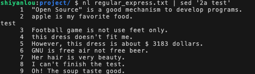

#### 使用 a 和 i 新增输出 ‘m,n[a,i] xxx’


在第二行后添加字符串 test：

```bash
nl regular_express.txt | sed '2a test'
```



在第二行前添加字符串 test：

```bash
nl regular_express.txt | sed '2i test'
```

在第二行后添加两行 test，`\n` 表示换行符：

```bash
nl regular_express.txt | sed '2a test\ntest'
```