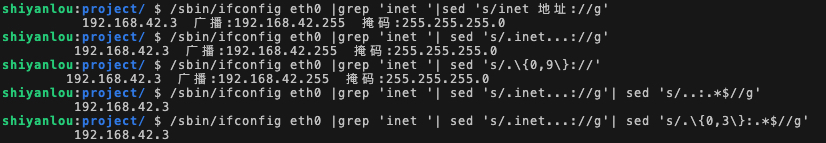

#### 字符串替换  😀‘s/old/new/pattern’


格式为：`sed 's/lodstr/newstr/g'`

来看一个实例。首先查看本机 IP 地址：

```bash
ifconfig eth0
```

字段**inet 地址：192.168.x.x**即为本机的 IP 地址，这是经由 NAT 转换后分配的内网 IP 地址，在此不做展开。若想进一步学习计算机网络的相关知识可以参阅 [TCP/IP 网络协议基础入门](https://www.lanqiao.cn/courses/98)。

之后使用 `grep` 指令在 `ifconfig eth0` 的结果中查找 `inet`，并打印至终端：

```bash
ifconfig eth0 | grep 'inet'
```

可以使用字符串替换功能将 IP 前面的部分予以删除，按照思路，也就是将 **inet 地址:** 替换为空字符串，可以简单写成：

```bash
ifconfig eth0 | grep 'inet '| sed 's/inet 地址://g'
```

（注意中文字符不能直接复制，需要自己在终端输入）

但正则表达式在实际应用中可以非常灵活，回想一下我们在前两节所学的关于正则表达式的知识（忘了也不要紧，可以随时返回查看）。

`.` 表示任意一个字符，`*` 表示重复字符，`{ }` 表示限定连续字符范围，所以正则表达式也可以写成：

```bash
ifconfig eth0 |grep 'inet '| sed 's/.inet...://g'
# 或者
ifconfig eth0 |grep 'inet '| sed 's/.\{0,9\}://'
```

表达式的写法并不唯一，在此也并未全部列出，大家亦可自行尝试使用其他写法，欢迎在评论区中讨论。

将 IP 后面的部分删除：

```bash
/sbin/ifconfig eth0 |grep 'inet '| sed 's/.inet...://g'| sed 's/..:.*$//g'

/sbin/ifconfig eth0 |grep 'inet '| sed 's/.inet...://g'| sed 's/.\{0,3\}:.*$//g'
```



上述指令是比较复杂的正则表达式运用，熟悉正则表达式后可以明显地简化指令，简单便捷地完成文件的查询、修改等任务。