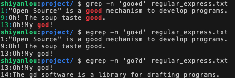

#### 扩展规则（一）✌️[+ ? *]


回忆一下，在非扩展正则表达式中，我们使用 `*` 来表示任意个重复字符（零至无穷多个）：

```bash
grep -n 'goo*d' regular_express.txt
```

在扩展正则表达式中，则可以进一步细分为*一个或一个以上*和*零个或一个*字符：

#### `+` 表示重复一个或一个以上的前一个字符

```bash
egrep -n 'go+d' regular_express.txt
```

#### `?` 表示重复零个或一个的前一个字符

```bash
egrep -n 'go?d' regular_express.txt
```

执行上述三条指令，比较三者的不同。

