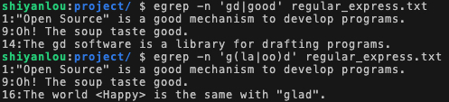
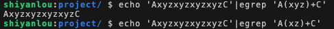

#### 扩展规则（二）🤔[ |  ()+ ]


#### `|` 表示用或（or）的方式找出数个字符串

查找 gd 或 good：

```bash
egrep -n 'gd|good' regular_express.txt
```

#### `()` 表示找出组字符串

查找 glad 或 good，注意到由于二者存在重复字母，所以可以将其合并：

```bash
egrep -n 'g(la|oo)d' regular_express.txt
```



#### `()+` 多个重复群组判别

查找开头是 A 结尾是 C 中间有一个以上的 `xyz` 或 `xz` 字符串：

```bash
echo 'AxyzxyzxyzxyzC'|egrep 'A(xyz)+C'

echo 'AxyzxyzxyzxyzC'|egrep 'A(xz)+C'
```

结果显示 `A(xyz)+C` 可以匹配，`A(xz)+C` 没有匹配项。

