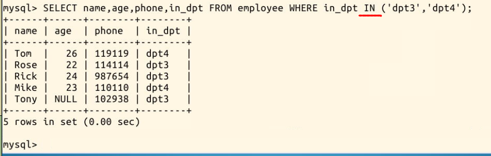
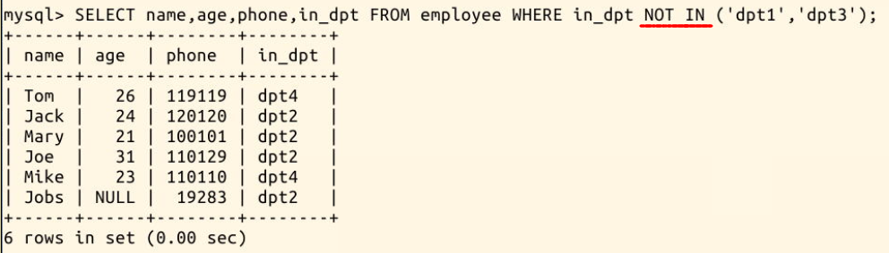

#### 3.4 IN 和 NOT IN


关键词 **IN** 和 **NOT IN** 的作用和它们的名字一样明显，用于筛选**“在”**或**“不在”**某个范围内的结果，比如说我们要查询在 **dpt3** 或 **dpt4** 的人:

```sql
SELECT name,age,phone,in_dpt FROM employee WHERE in_dpt IN ('dpt3','dpt4');
```



而 **NOT IN** 的效果则是，如下面这条命令，查询出了不在 **dpt1** 也不在 **dpt3** 的人：

```sql
SELECT name,age,phone,in_dpt FROM employee WHERE in_dpt NOT IN ('dpt1','dpt3');
```

