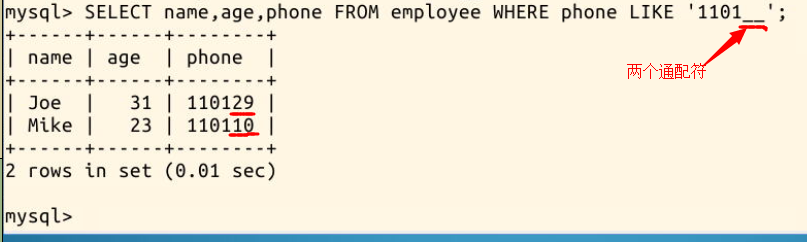
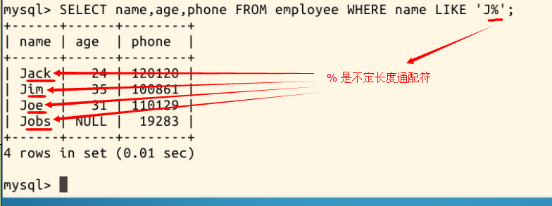

#### 3.5 通配符


关键字 **LIKE** 可用于实现模糊查询，常见于搜索功能中。

和 LIKE 联用的通常还有通配符，代表未知字符。SQL 中的通配符是 `_` 和 `%` 。其中 `_` 代表一个未指定字符，`%` 代表**不定个**未指定字符

比如，要只记得电话号码前四位数为 1101，而后两位忘记了，则可以用两个 `_` 通配符代替：

```sql
SELECT name,age,phone FROM employee WHERE phone LIKE '1101__';
```

这样就查找出了 **1101 开头的 6 位数电话号码**：



另一种情况，比如只记名字的首字母，又不知道名字长度，则用 `%` 通配符代替不定个字符：

```sql
SELECT name,age,phone FROM employee WHERE name LIKE 'J%';
```

这样就查找出了首字母为 **J** 的人：

