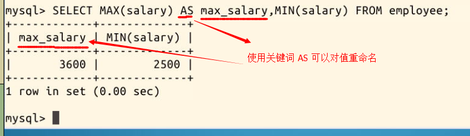

3.7 SQL内置函数和计算

2022年3月24日18:37:48

---

SQL 允许对表中的数据进行计算。对此，SQL 有 5 个内置函数，这些函数都对 SELECT 的结果做操作：

| 函数名： | COUNT | SUM  | AVG      | MAX    | MIN    |
| -------- | ----- | ---- | -------- | ------ | ------ |
| 作用：   | 计数  | 求和 | 求平均值 | 最大值 | 最小值 |

> 其中 COUNT 函数可用于任何数据类型(因为它只是计数)，而 SUM 、AVG 函数都只能对数字类数据类型做计算，MAX 和 MIN 可用于数值、字符串或是日期时间数据类型。

具体举例，比如计算出 salary 的最大、最小值，用这样的一条语句：

```sql
SELECT MAX(salary) AS max_salary,MIN(salary) FROM employee;
```

有一个细节你或许注意到了，**使用 AS 关键词可以给值重命名**，比如最大值被命名为了 max_salary：



