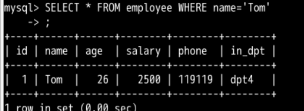
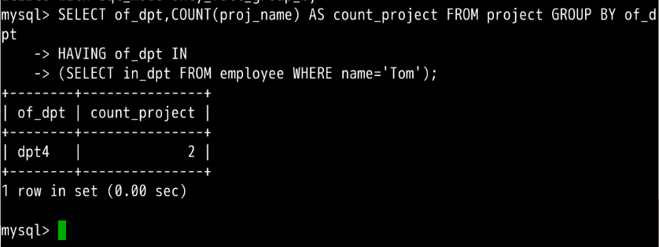

#### 3.8 子查询🤦‍♂️


2022年3月24日18:26:05

---

上面讨论的 SELECT 语句都仅涉及一个表中的数据，然而有时必须处理多个表才能获得所需的信息。例如：想要知道名为 "Tom" 的员工所在部门做了几个工程。员工信息储存在 employee 表中，但工程信息储存在 project 表中。

对于这样的情况，我们可以用子查询：

```sql
SELECT of_dpt,COUNT(proj_name) AS count_project FROM project GROUP BY of_dpt
HAVING of_dpt IN
(SELECT in_dpt FROM employee WHERE name='Tom');
```

上面代码包含两个 SELECT 语句，第二个 SELECT 语句将返回一个集合的数据形式，然后被第一个 SELECT 语句用 **in** 进行判断。😐其返回结果是;



==**<u>*HAVING 关键字可以的作用和 WHERE 是一样的，*</u>**==都是说明接下来要进行条件筛选操作。

区别在于 HAVING 用于对分组后的数据进行筛选




> 
>
> 子查询还可以扩展到 3 层、4 层或更多层。

