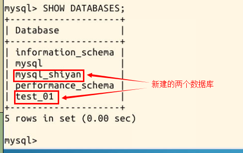
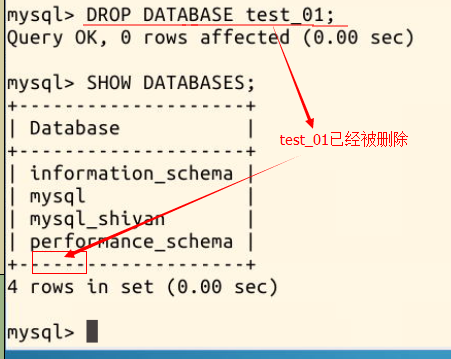

4.1 删除数据库😍

2022年3月24日18:48:16

---

使用命令 😊`SHOW DATABASES;` 可以看到刚才运行`MySQL-05.sql` 文件生成的两个数据库：



现在我们运行命令删除名为 `test_01` 的数据库：

```sql
DROP DATABASE test_01;
```

现在再次使用命令😀 `SHOW DATABASES;` 可以发现，`test_01` 数据库已经被成功删除：



#### 关于修改数据库

==目前 Mysql 没有提供修改数据库名称的方法，因为这曾导致一系列安全问题==。

在老版本中 RENAME DATABASE 可以修改数据库名称，这条命令在 MySQL 5.1.7 中被加入，但官方很快就发现这条命令所带来的危险，于是在 MySQL 5.1.23 中把这条命令移除。

事实上，数据库名几乎不会遇到必须修改的情况，如果你一定要这么做，比较安全的做法是重新建一个新库，然后将旧库中的数据转移到新库中，并且暂时不要删除旧的数据库，以防数据遗失。