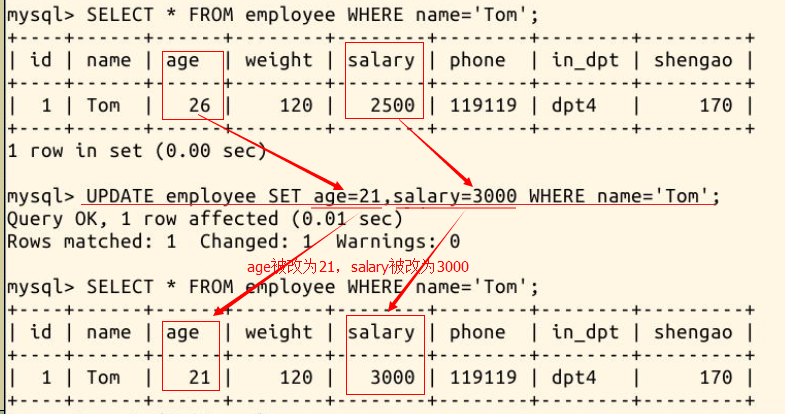
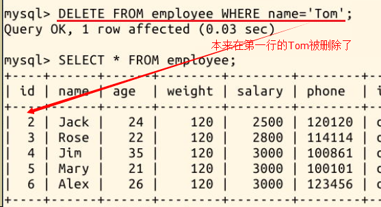

##### 4.4 对表的内容修改🤦‍♂️😣

2022年3月24日19:25:32  (❁´◡`❁)

---

#### 4.4.1 修改表中某个值

大多数时候我们需要做修改的不会是整个数据库或整张表，而是表中的某一个或几个数据，这就需要我们用下面这条命令达到精确的修改：

```sql
UPDATE 表名字 SET 列1=值1,列2=值2 WHERE 条件;
```

比如，我们要把 Tom 的 age 改为 21，salary 改为 3000：

```mysql
UPDATE employee SET age=21,salary=3000 WHERE name='Tom';
```



> 😛**注意：一定要有 WHERE 条件，否则会出现你不想看到的后果**

#### 4.4.2 删除一行记录

==删除表中的一行数据，也必须加上 WHERE 条件，否则整个数据库的数据都会被删除== 😱(最下面有测试)。删除语句：

```sql
DELETE FROM 表名字 WHERE 条件;
```

我们尝试把 Tom 的数据删除：

```mysql
DELETE FROM employee WHERE name='Tom';
```




```sql
mysql> select * from employee;
+----+------+------+--------+--------+--------+--------+---------+
| id | name | age  | weight | salary | phone  | in_dpt | shengao |
+----+------+------+--------+--------+--------+--------+---------+
|  2 | Jack |   24 |    120 |   2500 | 120120 | dpt2   |     170 |
|  3 | Rose |   22 |    120 |   2500 | 114114 | dpt3   |     170 |
|  4 | Jim  |   35 |    120 |   2500 | 100861 | dpt1   |     170 |
|  5 | Mary |   21 |    120 |   2500 | 100101 | dpt2   |     170 |
|  6 | Alex |   26 |    120 |   2500 | 123456 | dpt1   |     170 |
+----+------+------+--------+--------+--------+--------+---------+
5 rows in set (0.00 sec)

mysql> 
mysql> DELETE FROM employee;
Query OK, 5 rows affected (0.00 sec)

mysql> select * from employee;
Empty set (0.00 sec)

mysql> 

```

