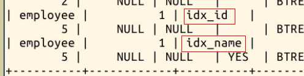

#### 三、实验步骤

2022年3月29日20:58:44

本节将通过实践操作，带领大家熟悉数据库的其它操作。

#### 3.1 索引

**索引是一种与表有关的结构，它的作用相当于书的目录，可以根据目录中的页码快速找到所需的内容。**

当表中有大量记C录时，若要对表进行查询，**没有索引的情况是全表搜索：将所有记录一一取出，和查询条件进行对比，然后返回满足条件的记录。**这样做会执行大量磁盘 I/O 操作，并花费大量数据库系统时间。

而如果在表中已建立索引，在索引中找到符合查询条件的索引值，通过索引值就可以快速找到表中的数据，可以**大大加快查询速度**。

对一张表中的某个列建立索引，有以下两种语句格式：

```sql
ALTER TABLE 表名字 ADD INDEX 索引名 (列名);

CREATE INDEX 索引名 ON 表名字 (列名);
```

我们用这两种语句分别建立索引：

```sql
ALTER TABLE employee ADD INDEX idx_id (id);  #在employee表的id列上建立名为idx_id的索引

CREATE INDEX idx_name ON employee (name);   #在employee表的name列上建立名为idx_name的索引
```

索引的效果是加快查询速度，当表中数据不够多的时候是感受不出它的效果的。这里我们使用命令 **SHOW INDEX FROM 表名字;** 查看刚才新建的索引：



在使用 SELECT 语句查询的时候，语句中 WHERE 里面的条件，会**自动判断有没有可用的索引**。

比如有一个用户表，它拥有用户名(username)和个人签名(note)两个字段。其中用户名具有唯一性，并且格式具有较强的限制，我们给用户名加上一个唯一索引；个性签名格式多变，而且允许不同用户使用重复的签名，不加任何索引。

这时候，如果你要查找某一用户，使用语句 `select * from user where username=?` 和 `select * from user where note=?` 性能是有很大差距的，对**建立了索引的用户名**进行条件查询会比**没有索引的个性签名**条件查询快几倍，在数据量大的时候，这个差距只会更大。

一些字段不适合创建索引，比如性别，这个字段存在大量的重复记录无法享受索引带来的速度加成，甚至会拖累数据库，导致数据冗余和额外的 CPU 开销。


下一步